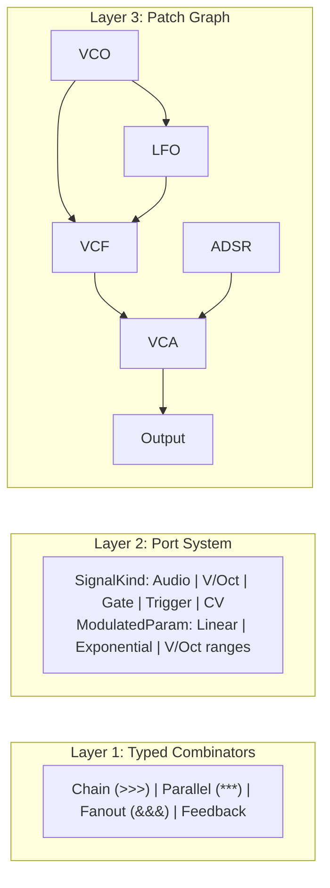

# Quiver

[](https://github.com/alexnodeland/quiver/actions/workflows/ci.yml)
[](https://github.com/alexnodeland/quiver/actions/workflows/docs.yml)
[](https://github.com/alexnodeland/quiver/actions/workflows/ci.yml)
[](LICENSE)
[](https://www.rust-lang.org/)

A modular audio synthesis library using Arrow-style combinators and graph-based patching.

## Table of Contents

- [Why Quiver?](#why-quiver)
- [Features](#features)
- [Architecture](#architecture)
- [Quick Start](#quick-start)
- [Documentation](#documentation)
- [Examples](#examples)
- [Development](#development)
- [Contributing](#contributing)
- [License](#license)

## Why Quiver?

Traditional audio synthesis libraries often force you to choose between:
- **Low-level control** with verbose, error-prone code
- **High-level convenience** that hides the signal flow

Quiver gives you both. Inspired by category theory and modular synthesizers, it provides:

| Approach | Benefit |
|----------|---------|
| **Arrow Combinators** | Compose modules like functions with type-safe operators |
| **Patch Graph** | Visual, intuitive signal routing like hardware modular synths |
| **Analog Modeling** | Authentic warmth with component drift and saturation |
| **Zero Allocation** | Real-time safe with predictable performance |

```rust
// Compose modules functionally
let synth = oscillator >>> filter >>> amplifier;

// Or patch them like hardware
patch.connect(vco, "out", vcf, "input");
```

## Features

- **Typed Combinators**: Compose audio modules using category-theory-inspired operators (`>>>`, `***`, `&&&`)
- **Graph-Based Patching**: Build complex synthesizer patches with a flexible node/cable system
- **Analog Modeling**: Realistic VCO drift, filter saturation, and component tolerances
- **Polyphony**: Built-in voice allocation with multiple algorithms
- **SIMD Optimization**: Optional vectorized processing for performance-critical applications
- **Serialization**: Save and load patches as JSON

## Architecture

Quiver is built in three composable layers:



**Layer 1 - Combinators**: Functional composition with type-safe signal flow
**Layer 2 - Ports**: Rich metadata for inputs/outputs with modulation support
**Layer 3 - Graph**: Visual patching with cables, mixing, and normalled connections

## Quick Start

Add Quiver to your `Cargo.toml`:

```toml
[dependencies]
quiver = "0.1"
```

Build a simple synthesizer patch:

```rust
use quiver::prelude::*;

fn main() {
    // Create a patch
    let mut patch = Patch::new();

    // Add modules
    let vco = patch.add_module(Vco::new());
    let vcf = patch.add_module(Svf::new());
    let vca = patch.add_module(Vca::new());
    let output = patch.add_module(StereoOutput::new());

    // Connect them
    patch.connect(vco, "out", vcf, "input");
    patch.connect(vcf, "lowpass", vca, "input");
    patch.connect(vca, "out", output, "left");

    // Process audio
    patch.tick();
}
```

## Documentation

| Resource | Description |
|----------|-------------|
| [User Guide](https://alexnodeland.github.io/quiver/) | Comprehensive tutorials and concepts |
| [API Reference](https://alexnodeland.github.io/quiver/api/quiver/) | Rustdoc documentation |
| [Examples](./examples/) | Runnable example patches |
| [DEVELOPMENT.md](./DEVELOPMENT.md) | Architecture decisions and roadmap |

## Examples

Run the examples to hear Quiver in action:

```bash
# Simple patch demo
cargo run --example simple_patch

# FM synthesis tutorial
cargo run --example tutorial_fm

# Polyphonic synth
cargo run --example tutorial_polyphony

# See all examples
cargo run --example
```

### Example Patches

| Example | Description |
|---------|-------------|
| `simple_patch` | Basic VCO → VCF → VCA signal chain |
| `tutorial_fm` | FM synthesis with modulator/carrier |
| `tutorial_polyphony` | Polyphonic voice allocation |
| `tutorial_subtractive` | Classic subtractive synthesis |
| `howto_midi` | MIDI input handling |

## Development

```bash
# Setup development environment (installs tools and git hooks)
make setup

# Run all checks (format, lint, test)
make check

# Run tests with coverage (80% threshold)
make coverage

# Format and lint
make fmt lint

# Generate changelog
make changelog

# See all available commands
make help
```

See [DEVELOPMENT.md](./DEVELOPMENT.md) for the development roadmap and architecture decisions.

## Contributing

Contributions are welcome! Please read our [Contributing Guidelines](./.github/CONTRIBUTING.md) before submitting a PR.

### Areas Where Help is Appreciated

| Area | Examples |
|------|----------|
| **DSP Algorithms** | Filter models, oscillator antialiasing, effects |
| **Testing** | Audio comparison tests, performance benchmarks |
| **Documentation** | Tutorials, examples, API docs |
| **Modules** | Classic hardware module implementations |

### Quick Contribution Guide

1. Fork the repository
2. Create a feature branch (`git checkout -b feature/amazing-filter`)
3. Make your changes
4. Run checks (`make check`)
5. Commit with [conventional commits](https://www.conventionalcommits.org/)
6. Open a Pull Request

Look for issues labeled [`good first issue`](https://github.com/alexnodeland/quiver/labels/good%20first%20issue) to get started!

## License

This project is licensed under the MIT License - see the [LICENSE](LICENSE) file for details.
