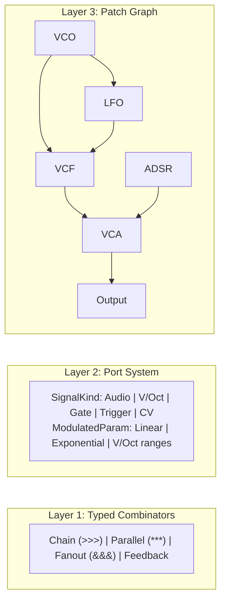

# 🏹 Quiver

[](https://github.com/alexnodeland/quiver/actions/workflows/ci.yml)
[](https://github.com/alexnodeland/quiver/actions/workflows/docs.yml)
[](https://github.com/alexnodeland/quiver/actions/workflows/ci.yml)
[](LICENSE)
[](https://www.rust-lang.org/)

A modular audio synthesis library using Arrow-style combinators and graph-based patching.

## Table of Contents

- [Project Status](#-project-status)
- [Why Quiver?](#-why-quiver)
- [Features](#-features)
- [Architecture](#-architecture)
- [Quick Start](#-quick-start)
- [Documentation](#-documentation)
- [Examples](#-examples)
- [Development](#-development)
- [Contributing](#-contributing)
- [License](#-license)

## 🚧 Project Status

Quiver is **pre-1.0 and under active development**. There are no published releases
yet — depend on it via git if you want to experiment. The three-layer architecture is
in place and the module set is broad, but the **public API is still evolving** and may
change between commits without notice. Expect rough edges; feedback and contributions
are very welcome.

## 🤔 Why Quiver?

Traditional audio synthesis libraries often force you to choose between:
- **Low-level control** with verbose, error-prone code
- **High-level convenience** that hides the signal flow

Quiver gives you both. Inspired by category theory and modular synthesizers, it provides:

| Approach | Benefit |
|----------|---------|
| 🔗 **Arrow Combinators** | Compose modules like functions with type-safe operators |
| 🎛️ **Patch Graph** | Visual, intuitive signal routing like hardware modular synths |
| 🎚️ **Analog Modeling** | Authentic warmth with component drift and saturation |
| ⚡ **Zero Allocation** | Real-time safe with predictable performance |

```rust
// Compose modules functionally with Arrow-style combinators
let synth = oscillator >>> filter >>> amplifier;

// Or patch them like hardware, jack to jack
patch.connect(vco.out("saw"), vcf.in_("in")).unwrap();
```

### How Quiver Compares

Quiver's niche is an **embeddable, Rust-first modular-synth graph with hardware-style
semantics** — a `no_std` core plus first-class WebAssembly bindings.

| | Quiver | [FunDSP](https://github.com/SamiPerttu/fundsp) | [VCV Rack](https://vcvrack.com/) | [Glicol](https://glicol.org/) / Web Audio |
|---|--------|--------|----------|--------------------|
| Form | Rust **library** | Rust **library** | Desktop **application** | DSL / browser graph |
| Model | Modular graph **+** Arrow combinators | Combinator DSP graphs | Patchable rack of plugins | Live-coding / node graph |
| Semantics | Hardware-style ports (V/Oct, gate, CV, normalled jacks) | Signal-flow operators | Eurorack-style modules | Audio nodes / DSL |
| `no_std` core | ✅ | partial | ❌ | ❌ |
| WASM bindings | ✅ (first-class) | via wasm-pack | ❌ | ✅ (browser-native) |
| Zero-alloc audio path | ✅ | ✅ | n/a | n/a |

If you want a signal-flow combinator DSP library, FunDSP is excellent and an inspiration.
If you want a finished desktop instrument, use VCV Rack. Quiver is for **building** modular
instruments and tools — in native apps, plugins, or the browser — from Rust.

## ✨ Features

- 🔗 **Typed Combinators**: Compose audio modules using category-theory-inspired operators (`>>>`, `***`, `&&&`)
- 🎛️ **Graph-Based Patching**: Build complex synthesizer patches with a flexible node/cable system
- 🎚️ **Analog Modeling**: Realistic VCO drift, filter saturation, and component tolerances
- 🎹 **Polyphony**: Built-in voice allocation with multiple algorithms
- ⚡ **SIMD Optimization**: Optional vectorized processing for performance-critical applications
- 💾 **Serialization**: Save and load patches as JSON
- 🔧 **`no_std` Support**: Run on embedded systems and WebAssembly targets

## 🏗️ Architecture

Quiver is built in three composable layers:


```mermaid
graph TD
    subgraph "Layer 3: Patch Graph"
        VCO[VCO] --> VCF[VCF]
        VCF --> VCA[VCA]
        VCA --> Output[Output]
        VCO --> LFO[LFO]
        LFO --> VCF
        ADSR[ADSR] --> VCA
    end

    subgraph "Layer 2: Port System"
        Ports["SignalKind: Audio | V/Oct | Gate | Trigger | CV<br/>ModulatedParam: Linear | Exponential | V/Oct ranges"]
    end

    subgraph "Layer 1: Typed Combinators"
        Combinators["Chain (>>>) | Parallel (***) | Fanout (&&&) | Feedback"]
    end

    Output ~~~ Ports
    Ports ~~~ Combinators
```

**Layer 1 - Combinators**: Functional composition with type-safe signal flow
**Layer 2 - Ports**: Rich metadata for inputs/outputs with modulation support
**Layer 3 - Graph**: Visual patching with cables, mixing, and normalled connections

## 🚀 Quick Start

Add Quiver to your `Cargo.toml` (the package is published as `quiver-dsp`
because the bare name `quiver` was taken on crates.io; the library name is
still `quiver`, so imports are `use quiver::...`):

```toml
[dependencies]
quiver-dsp = "0.1"
```

### Feature Flags

| Feature | Default | Description |
|---------|---------|-------------|
| `std` | Yes | Full functionality including OSC, plugins, visualization (implies `alloc`) |
| `alloc` | No | Serialization, presets, and I/O for `no_std` + heap environments |
| `simd` | No | SIMD vectorization for block processing (works with any tier) |
| `wasm` | No | WebAssembly bindings (`wasm-bindgen`) + TypeScript types (`tsify`); implies `alloc`. Powers [`packages/@quiver-dsp/wasm`](./packages/@quiver-dsp/wasm) and the [browser synth demo](./demos/browser) |

### `no_std` Support

Quiver supports three tiers for different environments. All tiers are `no_std`
but require a global allocator — the core graph uses `Box`/`Vec`/`String`, so
there is no allocator-free tier:

```toml
# Tier 1: Core DSP only (no_std, heap required — bring your own #[global_allocator])
quiver-dsp = { version = "0.1", default-features = false }

# Tier 2: With serialization & presets (WASM web apps)
quiver-dsp = { version = "0.1", default-features = false, features = ["alloc"] }

# Tier 3: Full std (desktop apps, default)
quiver-dsp = "0.1"
```

| Tier | DSP | Serialize | Presets | I/O | OSC/Plugins | Visual |
|------|-----|-----------|---------|-----|-------------|--------|
| Core | ✓ | | | | | |
| `alloc` | ✓ | ✓ | ✓ | ✓ | | |
| `std` | ✓ | ✓ | ✓ | ✓ | ✓ | ✓ |

Build a subtractive synthesizer voice — VCO → VCF → VCA, shaped by an ADSR envelope:

```rust
use quiver::prelude::*;

fn main() {
    // Create a patch at CD-quality sample rate.
    let sr = 44_100.0;
    let mut patch = Patch::new(sr);

    // Add modules — each `add` takes a name and returns a `NodeHandle`
    // used to reference that module's ports.
    let vco = patch.add("vco", Vco::new(sr));
    let vcf = patch.add("vcf", Svf::new(sr));
    let vca = patch.add("vca", Vca::new());
    let env = patch.add("env", Adsr::new(sr));
    let out = patch.add("out", StereoOutput::new());

    // Patch cables jack-to-jack: VCO → VCF → VCA → stereo out.
    // `in_()` is spelled with a trailing underscore because `in` is a Rust keyword.
    patch.connect(vco.out("saw"), vcf.in_("in")).unwrap();
    patch.connect(vcf.out("lp"), vca.in_("in")).unwrap();
    patch.connect(vca.out("out"), out.in_("left")).unwrap();
    patch.connect(vca.out("out"), out.in_("right")).unwrap();

    // The envelope modulates both the filter cutoff and the amplitude.
    patch.connect(env.out("env"), vcf.in_("cutoff")).unwrap();
    patch.connect(env.out("env"), vca.in_("cv")).unwrap();

    // Select the output module, then compile before processing (required).
    patch.set_output(out.id());
    patch.compile().unwrap();

    // Advance the patch one sample at a time; each `tick()` returns stereo audio.
    let (left, right) = patch.tick();
    println!("first sample: {left}, {right}");
}
```

## 📚 Documentation

| Resource | Description |
|----------|-------------|
| 📖 [User Guide](https://alexnodeland.github.io/quiver/) | Comprehensive tutorials and concepts |
| 🎛️ [Live Playground](https://alexnodeland.github.io/quiver/playground/) | The full synth engine (WASM) playable in your browser |
| 📋 [API Reference](https://alexnodeland.github.io/quiver/api/quiver/) | Rustdoc documentation |
| 💡 [Examples](./examples/) | Runnable example patches |
| 🗺️ [DEVELOPMENT.md](./DEVELOPMENT.md) | Architecture decisions and roadmap |

## 🎵 Examples

Run the examples to hear Quiver in action:

```bash
# Simple patch demo
cargo run --example simple_patch

# FM synthesis tutorial
cargo run --example tutorial_fm

# Polyphonic synth
cargo run --example tutorial_polyphony

# See all examples
cargo run --example
```

### Example Patches

| Example | Description |
|---------|-------------|
| `simple_patch` | Basic VCO → VCF → VCA signal chain |
| `tutorial_fm` | FM synthesis with modulator/carrier |
| `tutorial_polyphony` | Polyphonic voice allocation |
| `tutorial_subtractive` | Classic subtractive synthesis |
| `howto_midi` | MIDI input handling |

## 🛠️ Development

```bash
# Setup development environment (installs tools and git hooks)
make setup

# Run all checks (format, lint, test)
make check

# Run tests with coverage (80% threshold)
make coverage

# Format and lint
make fmt lint

# Generate changelog
make changelog

# See all available commands
make help
```

See [DEVELOPMENT.md](./DEVELOPMENT.md) for the development roadmap and architecture decisions.

## 🤝 Contributing

Contributions are welcome! Please read our [Contributing Guidelines](./.github/CONTRIBUTING.md) before submitting a PR.

### Areas Where Help is Appreciated

| Area | Examples |
|------|----------|
| 🔊 **DSP Algorithms** | Filter models, oscillator antialiasing, effects |
| 🧪 **Testing** | Audio comparison tests, performance benchmarks |
| 📝 **Documentation** | Tutorials, examples, API docs |
| 🎛️ **Modules** | Classic hardware module implementations |

### Quick Contribution Guide

1. Fork the repository
2. Create a feature branch (`git checkout -b feature/amazing-filter`)
3. Make your changes
4. Run checks (`make check`)
5. Commit with [conventional commits](https://www.conventionalcommits.org/)
6. Open a Pull Request

Look for issues labeled [`good first issue`](https://github.com/alexnodeland/quiver/labels/good%20first%20issue) to get started!

## 📄 License

This project is licensed under the MIT License - see the [LICENSE](LICENSE) file for details.
