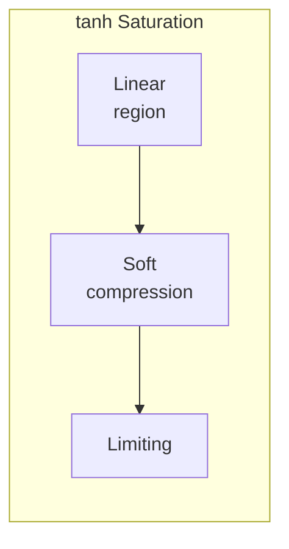
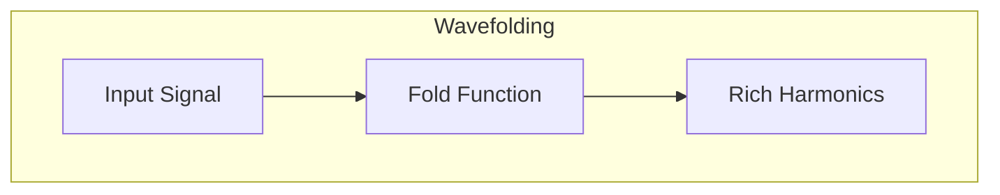
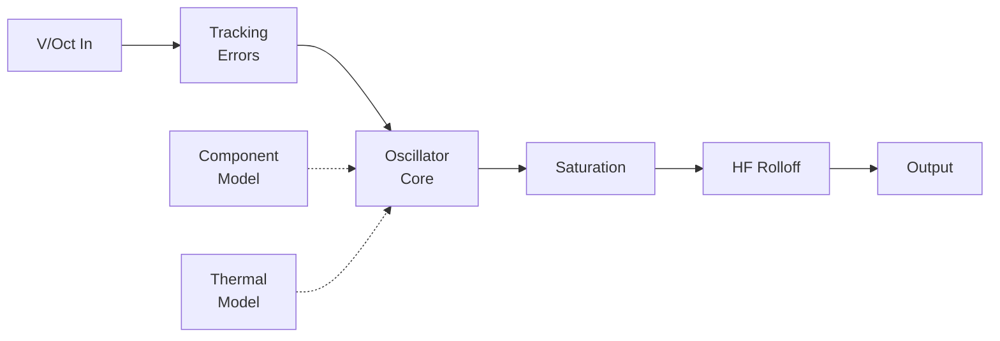

# Analog Modeling

Quiver includes tools to model the imperfections and character of analog hardware. These subtle variations are what make vintage synthesizers sound "alive."

## Why Model Analog?

Digital audio is mathematically perfect. Analog audio has:

- **Component tolerance**: Resistors/capacitors vary ±1-5%
- **Thermal drift**: Parameters change with temperature
- **Nonlinearities**: Saturation, clipping, distortion
- **Noise**: Thermal noise, power supply hum

These "imperfections" create the warmth and character we love.

## Saturation Functions

Quiver provides several saturation models:

### Hyperbolic Tangent

Smooth, tube-like warmth:

$$y = \tanh(x \cdot \text{drive})$$

```rust,ignore
use quiver::analog::saturation;

let output = saturation::tanh_sat(input, drive);
```



### Soft Clipping

Adjustable knee:

$$y = \begin{cases}
x & |x| < k \\
\text{sign}(x) \cdot (k + (1-k) \cdot \tanh(\frac{|x|-k}{1-k})) & |x| \geq k
\end{cases}$$

```rust,ignore
let output = saturation::soft_clip(input, knee);
```

### Asymmetric Saturation

Even harmonics from asymmetry (like tubes):

$$y = \tanh(a \cdot x^+) - \tanh(b \cdot x^-)$$

```rust,ignore
let output = saturation::asym_sat(input, pos_drive, neg_drive);
```

### Diode Clipping

Hard edges like guitar pedals:

$$y = \begin{cases}
\text{threshold} & x > \text{threshold} \\
x & |x| \leq \text{threshold} \\
-\text{threshold} & x < -\text{threshold}
\end{cases}$$

### Wave Folding

Complex harmonics through folding:



$$y = \sin(\text{folds} \cdot \pi \cdot x)$$

## Component Modeling

### ComponentModel

Simulates real component variation:

```rust,ignore
use quiver::analog::ComponentModel;

// 1% tolerance like precision resistors
let model = ComponentModel::resistor_1_percent();

// 5% tolerance like standard capacitors
let model = ComponentModel::capacitor_5_percent();

// Apply to a value
let actual_value = model.apply(nominal_value);
```

Each instance gets a random offset within tolerance, creating unique "units."

### Example: Filter Cutoff Variation

```rust,ignore
// Two filters with component variation
let filter1 = DiodeLadderFilter::new(44100.0)
    .with_component_model(ComponentModel::capacitor_5_percent());
let filter2 = DiodeLadderFilter::new(44100.0)
    .with_component_model(ComponentModel::capacitor_5_percent());

// filter1 and filter2 will have slightly different cutoffs
// even with identical CV input
```

## Thermal Modeling

### ThermalModel

Temperature affects component values:

```rust,ignore
use quiver::analog::ThermalModel;

let thermal = ThermalModel::new()
    .with_temp_coefficient(0.002)  // 0.2% per °C
    .with_time_constant(30.0);     // 30 second thermal lag

// In processing loop
let temp_factor = thermal.update(ambient_temp, dt);
let adjusted_value = base_value * temp_factor;
```

This creates slow drift that adds organic movement.

## V/Oct Tracking Errors

Real oscillators don't track pitch perfectly:

```rust,ignore
use quiver::analog::VoctTrackingModel;

let tracking = VoctTrackingModel::new()
    .with_tracking_error(0.01)      // 1% scale error
    .with_offset_error(0.005);      // 5mV offset

let actual_voct = tracking.apply(intended_voct);
```

This is why analog synths need tuning!

## High Frequency Rolloff

Real circuits have bandwidth limits:

```rust,ignore
use quiver::analog::HighFrequencyRolloff;

let rolloff = HighFrequencyRolloff::new(44100.0)
    .with_cutoff(15000.0)  // -3dB at 15kHz
    .with_order(2);        // 12dB/octave

let filtered = rolloff.process(sample);
```

## The AnalogVco Module

Combines all effects:

```rust,ignore
use quiver::analog::AnalogVco;

let vco = AnalogVco::new(44100.0)
    .with_tracking(VoctTrackingModel::default())
    .with_rolloff(HighFrequencyRolloff::default())
    .with_components(ComponentModel::resistor_1_percent())
    .with_saturation(|x| saturation::tanh_sat(x, 1.5));
```



## Crosstalk

Signals bleeding between channels:

```rust,ignore
use quiver::modules::Crosstalk;

let crosstalk = Crosstalk::new()
    .with_amount(0.01);  // 1% bleed

// Left and right influence each other slightly
```

## Ground Loop Hum

Power supply noise:

```rust,ignore
use quiver::modules::GroundLoop;

let hum = GroundLoop::new(44100.0)
    .with_frequency(60.0)   // 60Hz (US) or 50Hz (EU)
    .with_amplitude(0.01)   // Very subtle
    .with_harmonics(3);     // Include some harmonics
```

## When to Use Analog Modeling

| Effect | Use Case |
|--------|----------|
| **Saturation** | Warmth, harmonics, preventing clipping |
| **Component tolerance** | Unique character per voice |
| **Thermal drift** | Slow organic movement |
| **V/Oct errors** | Vintage oscillator feel |
| **HF rolloff** | Soften digital harshness |
| **Crosstalk** | Subtle stereo interaction |
| **Ground loop** | Vintage authenticity |

## Performance Considerations

- **Saturation**: Cheap (just math)
- **Component models**: Cheap (multiply)
- **Thermal**: Very cheap (slow update)
- **Rolloff**: Medium (filter)
- **Full AnalogVco**: Sum of above

Use sparingly for character; most processing should be "clean" digital.
