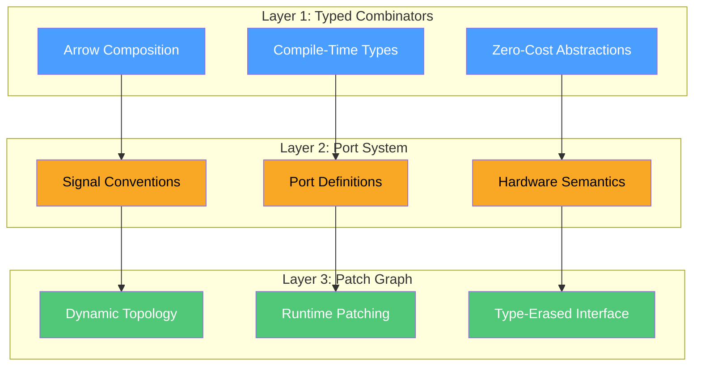
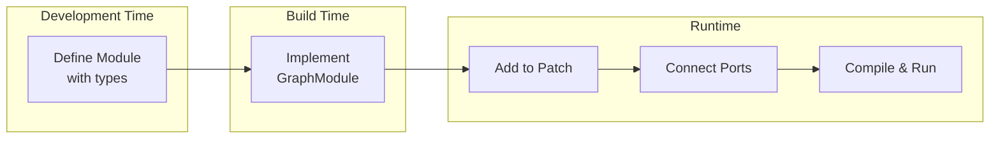

# The Three-Layer Architecture

Quiver's architecture bridges the gap between mathematical rigor and practical flexibility through three distinct layers.



## Layer 1: Typed Combinators

The foundational layer provides **Arrow-style functional composition** with full compile-time type checking.

### The Module Trait

```rust,ignore
pub trait Module: Send {
    type In;   // Input signal type
    type Out;  // Output signal type

    fn tick(&mut self, input: Self::In) -> Self::Out;
    fn process(&mut self, input: &[Self::In], output: &mut [Self::Out]);
    fn reset(&mut self);
    fn set_sample_rate(&mut self, sample_rate: f64);
}
```

The associated types `In` and `Out` enable compile-time verification that modules connect correctly.

### Combinators

The `ModuleExt` trait provides composition operations:

| Combinator | Signature | Purpose |
|------------|-----------|---------|
| `chain` | `A → B` then `B → C` = `A → C` | Sequential composition |
| `parallel` | `(A → B) *** (C → D)` = `(A,C) → (B,D)` | Parallel processing |
| `fanout` | `A → B` and `A → C` = `A → (B,C)` | Split input |
| `first` | `(A → B)` on `(A, X)` = `(B, X)` | Process first element |
| `feedback` | Loop with unit delay | Recursion |

### Type Safety Example

```rust,ignore
// This compiles: types match
let synth = vco.chain(vcf).chain(vca);
// Vco: () → f64
// Svf: f64 → f64
// Vca: f64 → f64
// Result: () → f64 ✓

// This won't compile: type mismatch
let bad = vco.chain(stereo_module);
// Vco: () → f64
// StereoModule: (f64, f64) → (f64, f64)
// Error: expected f64, found (f64, f64) ✗
```

## Layer 2: Port System

The middle layer adds **hardware semantics** through signal types and port definitions.

### Signal Kinds

```rust,ignore
pub enum SignalKind {
    Audio,           // ±5V AC-coupled audio
    CvBipolar,       // ±5V control voltage
    CvUnipolar,      // 0-10V control voltage
    VoltPerOctave,   // 1V/Oct pitch standard
    Gate,            // 0V or +5V sustained
    Trigger,         // 0V or +5V brief pulse
    Clock,           // Regular timing pulses
}
```

### Port Definitions

```rust,ignore
let spec = PortSpec::new()
    .with_input("in", PortDef::audio())
    .with_input("cutoff", PortDef::cv_unipolar().with_default(5.0))
    .with_output("lp", PortDef::audio())
    .with_output("hp", PortDef::audio());
```

### The GraphModule Trait

Bridges typed modules to the graph:

```rust,ignore
pub trait GraphModule: Send {
    fn port_spec(&self) -> PortSpec;
    fn tick(&mut self, inputs: &PortValues, outputs: &mut PortValues);
    fn reset(&mut self);
    fn set_sample_rate(&mut self, sample_rate: f64);
}
```

## Layer 3: Patch Graph

The top layer provides **runtime-configurable topology** for maximum flexibility.

### The Patch Container

```rust,ignore
pub struct Patch {
    nodes: SlotMap<NodeId, Box<dyn GraphModule>>,
    cables: Vec<Cable>,
    output_node: Option<NodeId>,
    processing_order: Vec<NodeId>,
}
```

### Key Operations

```rust,ignore
// Add modules
let vco = patch.add("vco", Vco::new(44100.0));

// Connect ports
patch.connect(vco.out("saw"), vcf.in_("in"))?;

// Compile for processing
patch.compile()?;

// Process audio
let (left, right) = patch.tick();
```

### Graph Processing

Compilation performs:
1. **Topological sort** (Kahn's algorithm)
2. **Cycle detection** (no feedback without explicit delay)
3. **Signal validation** (type checking with configurable strictness)

## Layer Interaction



### Example: Full Stack

```rust,ignore
// Layer 1: Typed module with compile-time checking
struct MyOsc {
    phase: f64,
    freq: f64,
}

impl Module for MyOsc {
    type In = f64;   // Frequency input
    type Out = f64;  // Audio output

    fn tick(&mut self, freq: f64) -> f64 {
        self.freq = freq;
        self.phase += freq / 44100.0;
        (self.phase * 2.0 * PI).sin() * 5.0
    }
}

// Layer 2: Port specification for graph integration
impl GraphModule for MyOsc {
    fn port_spec(&self) -> PortSpec {
        PortSpec::new()
            .with_input("freq", PortDef::cv_unipolar())
            .with_output("out", PortDef::audio())
    }

    fn tick(&mut self, inputs: &PortValues, outputs: &mut PortValues) {
        let freq = inputs.get("freq") * 20.0 + 20.0;  // 20-220 Hz
        let sample = <Self as Module>::tick(self, freq);
        outputs.set("out", sample);
    }
}

// Layer 3: Runtime patching
let osc = patch.add("osc", MyOsc { phase: 0.0, freq: 0.0 });
patch.connect(lfo.out("out"), osc.in_("freq"))?;
```

## When to Use Each Layer

| Layer | Use When |
|-------|----------|
| **Layer 1** | Building DSP algorithms with type safety |
| **Layer 2** | Defining module interfaces for reuse |
| **Layer 3** | Creating user-patchable synthesizers |

The layers compose naturally—you can write a tight, typed DSP core and expose it through the graph system for flexible routing.
