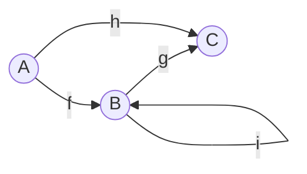
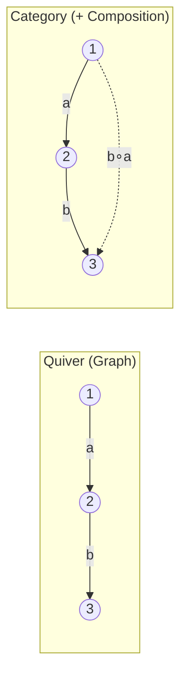

# Category Theory and Quivers

The name "Quiver" isn't arbitrary—it comes from category theory, where a **quiver** is a directed graph that forms the foundation for understanding morphisms and composition.

## What is a Quiver?

In mathematics, a quiver is a directed graph consisting of:
- A set of **vertices** (objects)
- A set of **arrows** (morphisms) between vertices



Sound familiar? This is exactly a modular synthesizer:
- **Vertices** = Modules
- **Arrows** = Patch cables

## Category Theory Basics

A **category** consists of:

1. **Objects**: Things we're studying (modules)
2. **Morphisms**: Transformations between objects (signal flow)
3. **Composition**: Combining morphisms (chaining modules)
4. **Identity**: Do-nothing morphism for each object

### The Laws

For any morphisms $f: A \to B$, $g: B \to C$, $h: C \to D$:

**Identity:**
$$\text{id}_B \circ f = f = f \circ \text{id}_A$$

**Associativity:**
$$(h \circ g) \circ f = h \circ (g \circ f)$$

## In Quiver's Terms

| Category Theory | Quiver Audio |
|-----------------|--------------|
| Objects | Signal types (`f64`, `(f64, f64)`) |
| Morphisms | Modules (`Vco`, `Svf`, `Vca`) |
| Composition | `chain` combinator |
| Identity | `Identity` module |

### The Identity Law

```rust,ignore
// Identity does nothing
let id = Identity::<f64>::new();

// f >>> id = f
let same1 = vco.chain(id);

// id >>> f = f
let same2 = id.chain(vco);
```

### The Associativity Law

```rust,ignore
// These produce identical behavior:
let way1 = (vco.chain(vcf)).chain(vca);
let way2 = vco.chain(vcf.chain(vca));

// Grouping doesn't matter—only the order
```

## Arrows: Richer Structure

Quiver uses **Arrow** semantics, an extension of categories that adds:

### First and Second

Apply a morphism to part of a pair:

```rust,ignore
// first: (A → B) → ((A, X) → (B, X))
let process_left = filter.first();  // Filter left channel only

// second: (A → B) → ((X, A) → (X, B))
let process_right = filter.second();  // Filter right channel only
```

### Parallel Composition (⊗)

Process two signals independently:

$$f \otimes g : (A, C) \to (B, D)$$

```rust,ignore
// Process stereo with different filters
let stereo = left_filter.parallel(right_filter);
// (f64, f64) → (f64, f64)
```

### Fanout (Δ)

Duplicate input to multiple processors:

$$\Delta_f^g : A \to (B, C)$$

```rust,ignore
// Send same input to two effects
let split = reverb.fanout(delay);
// f64 → (f64, f64)
```

## The Arrow Laws

For arrows $f$, $g$, $h$:

**Composition with `first`:**
$$\text{first}(f \ggg g) = \text{first}(f) \ggg \text{first}(g)$$

**Identity with `first`:**
$$\text{first}(\text{id}) = \text{id}$$

**Commutativity:**
$$\text{first}(f) \ggg (\text{id} \times g) = (\text{id} \times g) \ggg \text{first}(f)$$

These laws ensure that complex compositions behave predictably.

## Why This Matters

### 1. Predictable Behavior

The laws guarantee that refactoring preserves behavior:

```rust,ignore
// These are equivalent by associativity
let v1 = a.chain(b.chain(c));
let v2 = a.chain(b).chain(c);
// Safe to refactor between them
```

### 2. Type-Driven Design

Types prevent invalid connections:

```rust,ignore
// Type error: can't chain mono into stereo
let bad = mono_module.chain(stereo_module);
//        ^^^^^^^^^^^ f64
//                    ^^^^^^^^^^^^^^^^^ (f64, f64)
```

### 3. Compositionality

Build complex systems from simple parts:

```rust,ignore
// Each piece is simple
let voice = vco.chain(vcf).chain(vca);
let effects = delay.chain(reverb);
let mixer = voice.fanout(effects).chain(mix);

// Composition creates complexity
```

## Quivers vs Categories

A quiver is "pre-categorical"—it has the structure but not necessarily composition:



Quiver (the library) sits at this boundary:
- **Layer 3** is quiver-like: arbitrary graph structure
- **Layer 1** is category-like: composition is built-in

## The Free Category

Given a quiver, the **free category** adds all possible compositions. This is exactly what `compile()` does—it computes the transitive closure of signal flow.

```rust,ignore
// Define edges (quiver)
patch.connect(a, b);
patch.connect(b, c);

// compile() computes the free category
patch.compile()?;
// Now signal flows: a → b → c
```

## Further Reading

- *Categories for the Working Mathematician* — Saunders Mac Lane
- *Category Theory for Programmers* — Bartosz Milewski
- *Seven Sketches in Compositionality* — Fong & Spivak
