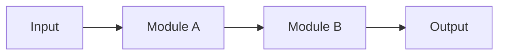
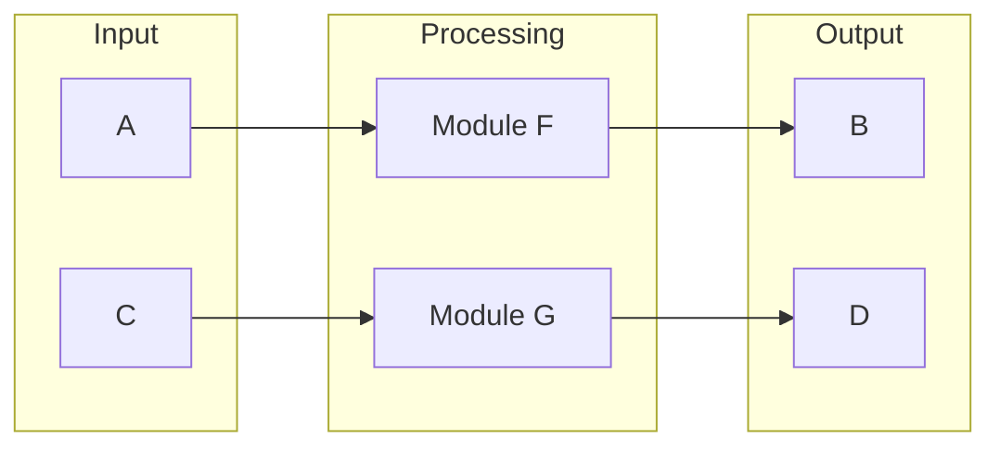
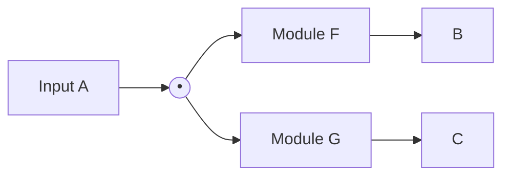
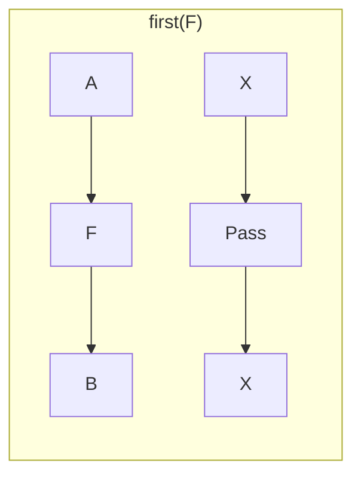
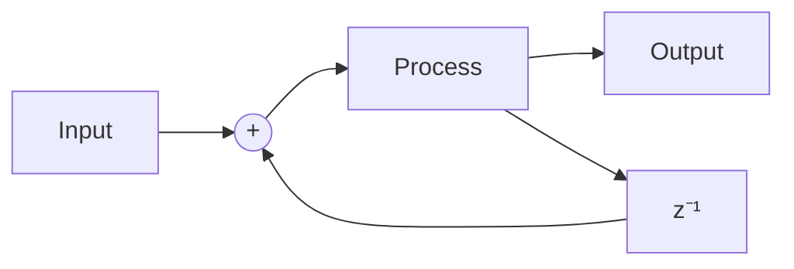
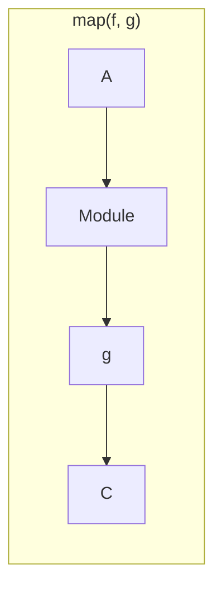

# Arrow Combinators

Quiver's Layer 1 provides Arrow-style combinators for composing DSP modules with compile-time type safety.

## The Core Abstraction

Every module is a function from input to output:

$$M : \text{In} \to \text{Out}$$

Combinators let us build complex modules from simple ones without losing type safety.

## Chain (Sequential Composition)

The most fundamental combinator: output of first feeds input of second.



$$\text{chain}(f, g) = g \circ f : A \to C$$

```rust,ignore
let synth = vco.chain(vcf).chain(vca);
// () → f64 → f64 → f64
// Types flow through automatically
```

## Parallel (Independent Processing)

Process two signals independently:



$$(f \parallel g)(a, c) = (f(a), g(c))$$

```rust,ignore
let stereo = left_channel.parallel(right_channel);
// (f64, f64) → (f64, f64)
```

## Fanout (Split and Process)

Send input to multiple processors:



$$\text{fanout}(f, g)(a) = (f(a), g(a))$$

```rust,ignore
let effects = signal.fanout(reverb, delay);
// f64 → (f64, f64)
```

## First and Second

Apply a module to only one part of a pair:



$$\text{first}(f)(a, x) = (f(a), x)$$

```rust,ignore
// Process only the left channel
let left_only = filter.first();
// (f64, f64) → (f64, f64)
```

## Feedback (With Delay)

Create a feedback loop with unit delay:



$$y[n] = f(x[n] + y[n-1])$$

```rust,ignore
let echo = delay.feedback(0.5);  // 50% feedback
```

## Map and Contramap

Transform signals without creating new modules:

```rust,ignore
// Map: transform output
let boosted = vco.map(|x| x * 2.0);

// Contramap: transform input
let scaled = vca.contramap(|x| x * 0.5);
```



## Identity

The do-nothing module—but type-safe:

```rust,ignore
let id = Identity::<f64>::new();
// f64 → f64, output equals input

// Useful for type alignment
let aligned = mono.parallel(Identity::new());
```

## Constant

Always produce the same output:

```rust,ignore
let dc = Constant::new(5.0);
// () → f64, always 5.0

// Useful for fixed CV values
let offset = Constant::new(2.5).chain(adder.second());
```

## Split and Merge

Work with tuples:

```rust,ignore
// Split: duplicate input
let dup = Split::<f64>::new();
// f64 → (f64, f64)

// Merge: combine with function
let summer = Merge::new(|a, b| a + b);
// (f64, f64) → f64
```

## Swap

Swap tuple elements:

```rust,ignore
let swapped = Swap::<f64, f64>::new();
// (A, B) → (B, A)
```

## Combining Combinators

Build complex signal flow:

```rust,ignore
// Classic synth voice with stereo chorus
let voice = vco
    .chain(vcf)
    .chain(vca)
    .chain(Split::new())  // Mono to stereo
    .chain(
        chorus_left.parallel(chorus_right)
    )
    .chain(
        Merge::new(|l, r| (l * 0.5, r * 0.5))
    );
```

## Type Inference

Rust's type inference works through combinators:

```rust,ignore
// Types are inferred
let synth = vco.chain(vcf).chain(vca);
// Compiler knows: () → f64

// Explicit types when needed
let stereo: Chain<VCO, Parallel<VCF, VCF>> = ...;
```

## Zero-Cost Abstraction

Combinators compile to efficient code:

```rust,ignore
// This combinator chain...
let synth = vco.chain(vcf).chain(vca);

// ...compiles to essentially:
fn tick(&mut self) -> f64 {
    self.vca.tick(
        self.vcf.tick(
            self.vco.tick(())
        )
    )
}
```

No heap allocation, no virtual dispatch, no runtime overhead.

## Pattern: Effect Rack

```rust,ignore
fn effect_rack(
    effects: Vec<Box<dyn Module<In=f64, Out=f64>>>
) -> impl Module<In=f64, Out=f64>
{
    effects.into_iter()
        .fold(Identity::new(), |acc, fx| acc.chain(fx))
}
```

## Pattern: Parallel Voices

```rust,ignore
fn parallel_voices<V: Module<In=f64, Out=f64>>(
    voices: [V; 4]
) -> impl Module<In=(f64, f64, f64, f64), Out=(f64, f64, f64, f64)>
{
    let [v1, v2, v3, v4] = voices;
    v1.parallel(v2).parallel(v3).parallel(v4)
}
```
