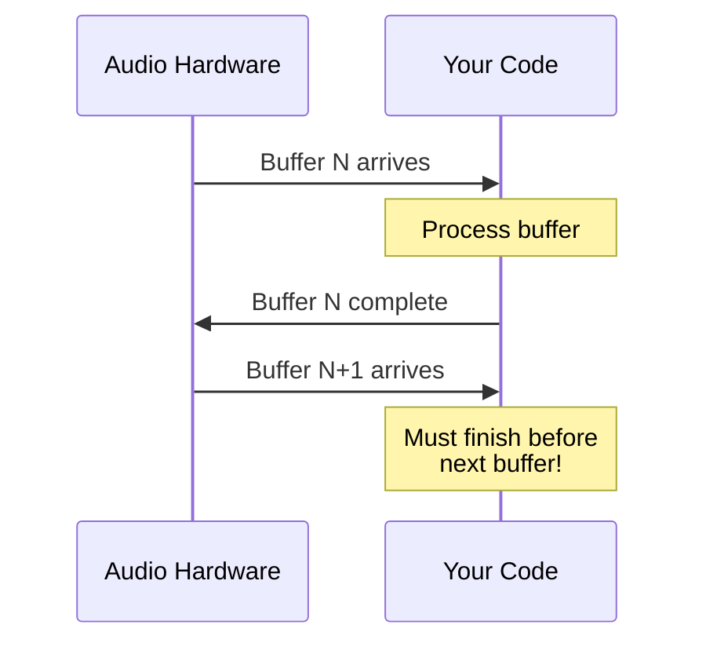
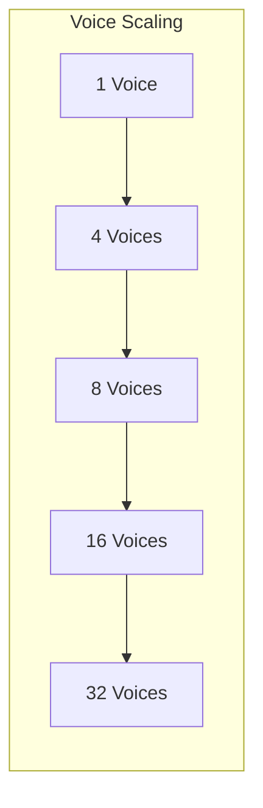

# Real-Time Latency Constraints

Real-time audio processing requires strict timing guarantees. This guide explains latency budgets, how to calculate them, and strategies for meeting real-time constraints.

## The Fundamental Constraint

Audio hardware delivers samples in fixed-size buffers at regular intervals. Your processing must complete before the next buffer arrives, or you'll hear clicks, pops, or dropouts.



## Time Budget Calculation

The time budget is determined by:

```
time_budget = buffer_size / sample_rate
```

### Common Configurations

| Sample Rate | Buffer 64  | Buffer 128 | Buffer 256 | Buffer 512 |
|-------------|------------|------------|------------|------------|
| 44.1 kHz    | 1.45 ms    | 2.90 ms    | 5.80 ms    | 11.61 ms   |
| 48 kHz      | 1.33 ms    | 2.67 ms    | 5.33 ms    | 10.67 ms   |
| 96 kHz      | 0.67 ms    | 1.33 ms    | 2.67 ms    | 5.33 ms    |
| 192 kHz     | 0.33 ms    | 0.67 ms    | 1.33 ms    | 2.67 ms    |

**Key insight**: Higher sample rates with smaller buffers give tighter deadlines. At 96 kHz with 128 samples, you have only 1.33 ms.

### Ultra-Low Latency

For live performance or software instruments:

| Buffer Size | Time @ 48 kHz | Use Case |
|-------------|---------------|----------|
| 16 samples  | 0.33 ms       | Hardware-like response |
| 32 samples  | 0.67 ms       | Professional monitoring |
| 48 samples  | 1.00 ms       | Live performance |
| 64 samples  | 1.33 ms       | Studio tracking |

These tight budgets require careful optimization.

## Round-Trip Latency

Total perceived latency includes:

```
total_latency = input_buffer + processing + output_buffer
```

With double-buffering (common in audio drivers):

```
round_trip = 2 × buffer_time = 2 × (buffer_size / sample_rate)
```

| Buffer | Round-Trip @ 48 kHz |
|--------|---------------------|
| 64     | 2.67 ms            |
| 128    | 5.33 ms            |
| 256    | 10.67 ms           |
| 512    | 21.33 ms           |

Musicians typically notice latency above 10-15 ms.

## Polyphony and Latency

Processing time scales with voice count. Quiver benchmarks show:



### Polyphony Guidelines

| Voices | Recommended Buffer | Notes |
|--------|-------------------|-------|
| 1-4    | 64-128 samples    | Low latency possible |
| 8-16   | 128-256 samples   | Typical synthesizer |
| 32+    | 256-512 samples   | High polyphony, larger buffer |

With unison enabled, each voice costs more:

```rust,ignore
// 8 voices × 4 unison = 32 effective oscillators
poly.set_unison(UnisonConfig::new(4, 15.0));
```

## Meeting Real-Time Constraints

### 1. Preallocate Everything

Never allocate memory in the audio callback:

```rust,ignore
// At initialization (OK)
let mut patch = Patch::new(sample_rate);
let mut buffer = AudioBlock::new(256);
patch.compile().unwrap();

// In audio callback
fn process(&mut self, output: &mut [f32]) {
    // ❌ NEVER allocate here
    // let data = vec![0.0; 256];

    // ✓ Use preallocated structures
    for sample in output.iter_mut() {
        *sample = self.patch.tick().0 as f32;
    }
}
```

### 2. Compile Patches Once

Topological sorting happens at compile time:

```rust,ignore
// At startup
patch.compile().unwrap();  // O(V + E) graph sort

// In audio callback
patch.tick();  // O(V) processing only
```

### 3. Avoid Blocking Operations

Never perform these in audio callbacks:

| Operation | Alternative |
|-----------|-------------|
| File I/O | Preload samples |
| Network | Use separate thread |
| Mutex locks | Use lock-free atomics |
| Memory allocation | Preallocate buffers |
| Console output | Log to ring buffer |

### 4. Use Block Processing

Process samples in blocks for better cache efficiency:

```rust,ignore
// Less efficient: sample-by-sample
for _ in 0..buffer_size {
    output = patch.tick();
}

// More efficient: leverage SIMD
let mut block = AudioBlock::new(buffer_size);
// Process full block with vectorized operations
block.mul_scalar(0.5);
```

See [Block Processing & SIMD](./performance.md) for details.

### 5. Profile Your Patches

Measure actual processing time:

```rust,ignore
use std::time::Instant;

let start = Instant::now();
for _ in 0..buffer_size {
    patch.tick();
}
let duration = start.elapsed();

let budget_ns = (buffer_size as f64 / sample_rate) * 1e9;
let usage_percent = (duration.as_nanos() as f64 / budget_ns) * 100.0;

eprintln!("CPU usage: {:.1}%", usage_percent);
```

Keep usage below 70% for headroom.

## Module Costs

Not all modules are equal. Relative costs from benchmarks:

| Module | Relative Cost | Notes |
|--------|--------------|-------|
| VCA | 1× | Baseline |
| LFO | 1× | Simple oscillator |
| ADSR | 1× | Envelope |
| VCO | 2× | Multiple waveforms |
| SVF | 3× | State-variable filter |
| DiodeLadder | 5× | Nonlinear modeling |
| Wavefolder | 4× | Saturation math |

Complex patches scale accordingly:

| Patch Type | Typical Modules | Relative Cost |
|------------|-----------------|---------------|
| Simple | VCO → VCF → VCA | ~6× |
| Modulated | + LFO, ADSR | ~8× |
| Complex | 2×VCO, Ladder, effects | ~15× |

## Configuration Recommendations

### Live Performance

Priority: Minimal latency

```rust,ignore
let sample_rate = 48000.0;
let buffer_size = 64;  // 1.33 ms

// Limit polyphony
let poly = PolyPatch::new(8, sample_rate);

// Use efficient filter
let vcf = Svf::new(sample_rate);  // Not DiodeLadder
```

### Studio Production

Priority: Balance latency and features

```rust,ignore
let sample_rate = 48000.0;
let buffer_size = 256;  // 5.33 ms

// More headroom for complex patches
let poly = PolyPatch::new(16, sample_rate);

// Can use heavier processing
let vcf = DiodeLadderFilter::new(sample_rate);
```

### Offline Rendering

Priority: Quality over latency

```rust,ignore
let sample_rate = 96000.0;
let buffer_size = 1024;  // Non-realtime

// Maximum polyphony
let poly = PolyPatch::new(64, sample_rate);

// Full analog modeling
let vco = AnalogVco::new(sample_rate);
```

## Measuring with Benchmarks

Run Quiver's benchmark suite to validate your system:

```bash
cargo bench --bench audio_performance
```

Key benchmarks:

- `realtime_compliance`: Tests common pro-audio configs
- `buffer_processing`: Per-buffer-size timing
- `polyphony/voice_scaling`: Voice count impact
- `stress/ultra_low_latency`: 16-48 sample buffers

Example output interpretation:

```
realtime_compliance/complex_patch/48kHz/256
    time: [423.1 µs 425.8 µs 428.9 µs]
```

Budget at 48 kHz / 256 samples = 5333 µs. Using 426 µs = **8% CPU**.

## Troubleshooting

### Audio Dropouts

1. **Increase buffer size** - Try doubling it
2. **Reduce polyphony** - Fewer voices = faster
3. **Simplify patches** - Remove expensive modules
4. **Check background processes** - CPU spikes cause glitches
5. **Profile the patch** - Find the bottleneck

### High CPU Usage

1. **Compile the patch** - Ensure `patch.compile()` was called
2. **Use SVF over DiodeLadder** - 40% cheaper
3. **Reduce unison** - Each adds full voice cost
4. **Lower sample rate** - 44.1 kHz vs 96 kHz
5. **Enable SIMD** - `features = ["simd"]`

### Inconsistent Timing

1. **Disable CPU scaling** - Set performance governor
2. **Isolate audio thread** - Pin to dedicated core
3. **Increase thread priority** - Real-time scheduling
4. **Check thermal throttling** - Cool your CPU

## Summary

| Scenario | Buffer | Latency | Max Voices |
|----------|--------|---------|------------|
| Live instrument | 64 | 1.33 ms | 4-8 |
| Studio tracking | 128 | 2.67 ms | 8-16 |
| Mixing | 256 | 5.33 ms | 16-32 |
| Mastering | 512+ | 10+ ms | Unlimited |

The key principles:

1. **Know your budget**: `buffer_size / sample_rate`
2. **Preallocate everything**: No allocations in callbacks
3. **Profile regularly**: Measure, don't guess
4. **Leave headroom**: Target 70% CPU max
5. **Trade-offs exist**: Latency vs. polyphony vs. complexity
