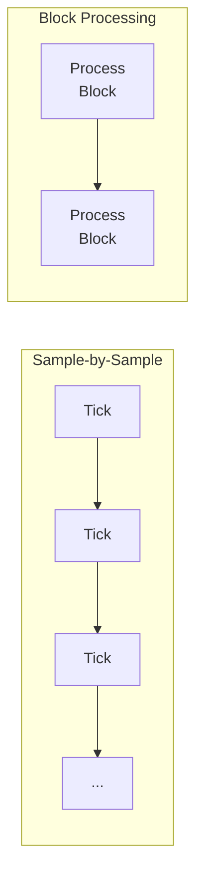
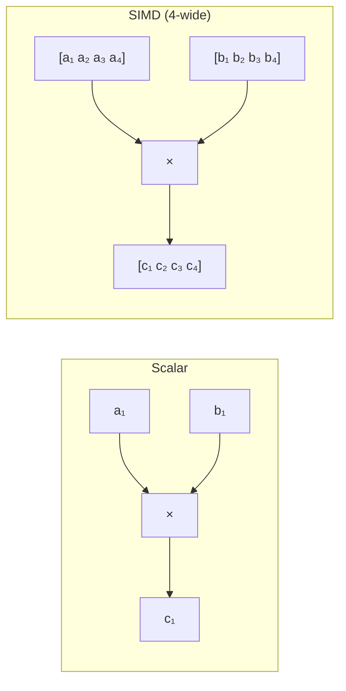
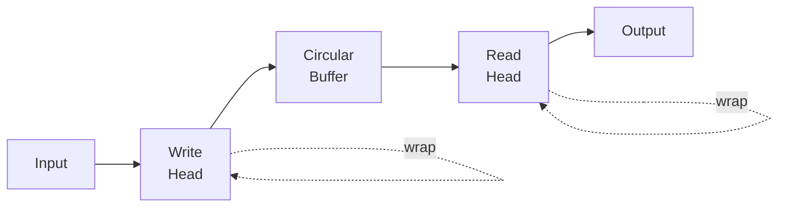

# Block Processing & SIMD

Real-time audio demands efficiency. Quiver provides tools for high-performance processing.

## The Challenge

Audio processing must:
1. Complete within the buffer deadline
2. Have bounded, predictable latency
3. Never block on locks or allocation

At 44.1kHz with 128-sample buffers, you have **~2.9ms** per callback.

## Block Processing

Instead of sample-by-sample, process in blocks:



### Benefits

| Aspect | Sample-by-Sample | Block |
|--------|------------------|-------|
| Function call overhead | Per sample | Per block |
| Cache efficiency | Poor | Good |
| SIMD opportunity | None | Full |
| Branch prediction | Frequent | Rare |

### AudioBlock

Quiver's block container:

```rust,ignore
use quiver::prelude::*;

const BLOCK_SIZE: usize = 64;  // Typical size

let mut block = AudioBlock::new();

// Fill with samples
for i in 0..BLOCK_SIZE {
    block[i] = generate_sample(i);
}

// Process entire block
filter.process_block(&mut block);
```

### StereoBlock

For stereo processing:

```rust,ignore
let mut stereo = StereoBlock::new();

// Set channels
stereo.set_left(&left_samples);
stereo.set_right(&right_samples);

// Pan operation
stereo.pan(0.3);  // 30% right

// Mix to mono
let mono = stereo.mix(0.5, 0.5);
```

## SIMD Vectorization

SIMD (Single Instruction Multiple Data) processes 4-8 samples simultaneously:



### Enabling SIMD

```toml
# Cargo.toml
[dependencies]
quiver = { version = "0.1", features = ["simd"] }
```

### SIMD Operations

```rust,ignore
use quiver::simd::*;

let mut block = AudioBlock::new();

// SIMD-accelerated operations
block.add_scalar(offset);     // Add constant
block.mul_scalar(gain);       // Multiply by constant
block.add_block(&other);      // Add another block
block.mul_block(&envelope);   // Multiply by envelope

// These use SSE/AVX when available
```

### Alignment

SIMD requires aligned memory:

```rust,ignore
// AudioBlock is automatically aligned
let block = AudioBlock::new();  // 16-byte aligned

// Manual alignment for custom types
#[repr(align(16))]
struct MyBuffer([f64; 64]);
```

## Lazy Evaluation

Defer computation until needed:

```rust,ignore
use quiver::simd::{LazySignal, LazyBlock};

// Create lazy signal
let lazy = LazySignal::new(|| expensive_computation());

// Value computed only when needed
let value = lazy.evaluate();

// Lazy block operations
let lazy_block = LazyBlock::new()
    .add_scalar(1.0)
    .mul_scalar(0.5)
    .add_block(&other);

// All operations fused when materialized
let result = lazy_block.materialize();
```

### Fusion Benefits

```rust,ignore
// Without fusion: 3 loops
for s in block { s += 1.0; }
for s in block { s *= 0.5; }
for s in block { s += other[i]; }

// With fusion: 1 loop
for i in 0..len {
    block[i] = (block[i] + 1.0) * 0.5 + other[i];
}
```

## Ring Buffers

Efficient delay lines:

```rust,ignore
use quiver::simd::RingBuffer;

let mut delay = RingBuffer::new(44100);  // 1 second

// Write sample, get delayed sample
let delayed = delay.tick(input);

// Access specific delay
let tapped = delay.read(11025);  // 0.25 second delay
```



## ProcessContext

Bundle processing state:

```rust,ignore
let ctx = ProcessContext {
    sample_rate: 44100.0,
    block_size: 64,
    transport_position: 0,
    is_playing: true,
};

module.process_with_context(&mut block, &ctx);
```

## Best Practices

### 1. Preallocate Everything

```rust,ignore
// Do this once at startup
let mut block = AudioBlock::new();
let mut delay = RingBuffer::new(max_delay);

// Not in the audio callback
let block = AudioBlock::new();  // ❌ Allocation!
```

### 2. Avoid Branching in Inner Loops

```rust,ignore
// Bad: branch per sample
for i in 0..len {
    if condition {
        block[i] = process_a(block[i]);
    } else {
        block[i] = process_b(block[i]);
    }
}

// Good: branch once per block
if condition {
    for i in 0..len { block[i] = process_a(block[i]); }
} else {
    for i in 0..len { block[i] = process_b(block[i]); }
}
```

### 3. Use Block Operations

```rust,ignore
// Bad: call per sample
for i in 0..len {
    block[i] = vco.tick();
}

// Good: block processing
vco.process(&[], &mut block);
```

### 4. Profile Regularly

```rust,ignore
use std::time::Instant;

let start = Instant::now();
process_block(&mut block);
let duration = start.elapsed();

if duration.as_secs_f64() * 1000.0 > 2.9 {
    eprintln!("Warning: approaching deadline!");
}
```

## Memory Layout

### Cache-Friendly Access

```rust,ignore
// Good: sequential access
for i in 0..len {
    output[i] = input[i] * gain;
}

// Bad: strided access
for i in (0..len).step_by(4) {
    output[i] = input[i] * gain;
}
```

### Structure of Arrays

For multiple parallel signals:

```rust,ignore
// Array of Structures (cache unfriendly)
struct Voice { phase: f64, freq: f64, amp: f64 }
let voices: [Voice; 8];

// Structure of Arrays (cache friendly)
struct Voices {
    phases: [f64; 8],
    freqs: [f64; 8],
    amps: [f64; 8],
}
```
