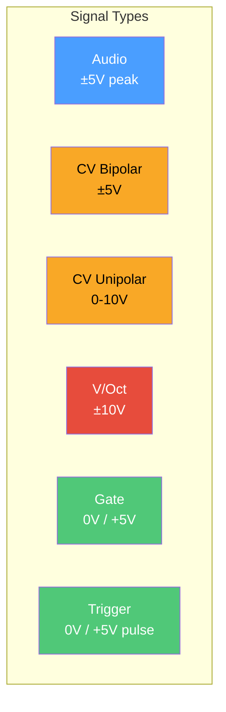
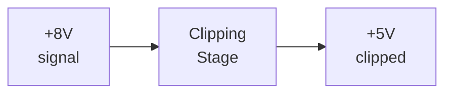
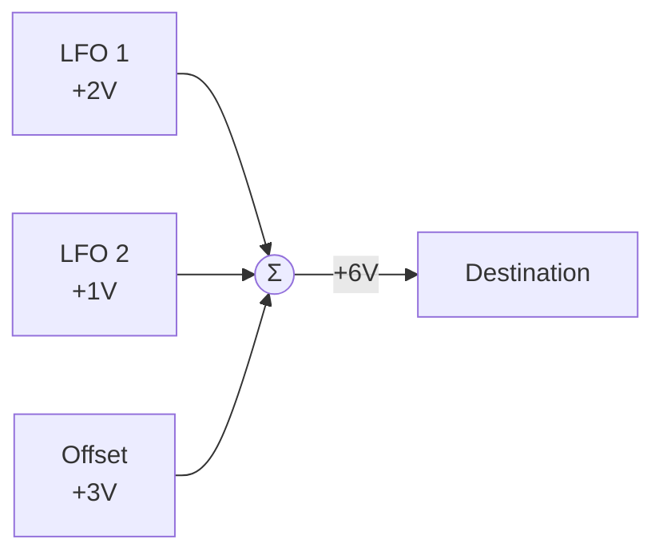

# Signal Conventions

Quiver adopts hardware modular synthesizer conventions for signal levels and types. Understanding these is essential for creating patches that behave predictably.

## Voltage Standards

The library models signals on the **Eurorack** standard:



## Audio Signals

Audio oscillates symmetrically around zero:

$$\text{audio}(t) \in [-5V, +5V]$$

- **Nominal level**: ±5V peak
- **AC-coupled**: No DC offset
- **Bandwidth**: 20Hz - 20kHz

```rust,ignore
// VCO outputs are ±5V audio
let saw = vco.out("saw");  // -5V to +5V
```

### Clipping

Signals exceeding ±5V may clip at later stages:



Some modules add soft saturation to avoid harsh clipping.

## Control Voltage (CV)

### Unipolar CV (0-10V)

For parameters that don't make sense negative:

| Parameter | Example Values |
|-----------|----------------|
| Filter cutoff | 0V = 20Hz, 10V = 20kHz |
| LFO rate | 0V = 0.01Hz, 10V = 30Hz |
| Envelope times | 0V = 1ms, 10V = 10s |

```rust,ignore
PortDef::cv_unipolar().with_default(5.0)
```

### Bipolar CV (±5V)

For parameters that can go both ways:

| Parameter | Example Values |
|-----------|----------------|
| Pan | -5V = left, +5V = right |
| Pitch bend | ±5V = ±semitones |
| FM depth | ±5V = direction |

```rust,ignore
PortDef::cv_bipolar().with_default(0.0)
```

## Volt-per-Octave (V/Oct)

The pitch standard: **1 volt = 1 octave**

$$f = f_0 \cdot 2^{V}$$

Where $f_0 = 261.63\text{Hz}$ (C4) at 0V.

### Reference Table

| Voltage | Note | MIDI | Frequency |
|---------|------|------|-----------|
| -3V | C1 | 24 | 32.70 Hz |
| -2V | C2 | 36 | 65.41 Hz |
| -1V | C3 | 48 | 130.81 Hz |
| **0V** | **C4** | **60** | **261.63 Hz** |
| +1V | C5 | 72 | 523.25 Hz |
| +2V | C6 | 84 | 1046.50 Hz |
| +3V | C7 | 96 | 2093.00 Hz |

### Semitones and Cents

$$\text{semitone} = \frac{1}{12}V \approx 83.33\text{mV}$$
$$\text{cent} = \frac{1}{1200}V \approx 0.833\text{mV}$$

```rust,ignore
// MIDI note to V/Oct
fn midi_to_voct(note: u8) -> f64 {
    (note as f64 - 60.0) / 12.0
}

// V/Oct to frequency
fn voct_to_freq(v: f64) -> f64 {
    261.63 * 2.0_f64.powf(v)
}
```

## Gates and Triggers

### Gate Signal

Sustained high while key is held:

```
     ┌──────────────┐
+5V  │              │
     │              │
 0V ─┘              └───
     Key Down    Key Up
```

- **High**: +5V (or >2.5V threshold)
- **Low**: 0V
- **Duration**: As long as key held

### Trigger Signal

Brief pulse to start an event:

```
     ┌┐
+5V  ││
     ││
 0V ─┘└────────────────
     1-10ms pulse
```

- **Duration**: 1-10ms typically
- **Use**: Clock pulses, envelope retriggers

## Clock Signals

Regular timing pulses:

```
 ┌─┐   ┌─┐   ┌─┐   ┌─┐
 │ │   │ │   │ │   │ │
─┘ └───┘ └───┘ └───┘ └─
  │         │
  └── 1 beat ──┘
```

Quiver's Clock module provides divisions:

| Output | Division |
|--------|----------|
| `div_1` | Whole notes |
| `div_2` | Half notes |
| `div_4` | Quarter notes |
| `div_8` | Eighth notes |
| `div_16` | Sixteenth notes |

## Signal Compatibility

The `SignalKind` enum helps validate connections:

```rust,ignore
pub enum SignalKind {
    Audio,         // ±5V audio
    CvBipolar,     // ±5V CV
    CvUnipolar,    // 0-10V CV
    VoltPerOctave, // Pitch
    Gate,          // 0/+5V sustained
    Trigger,       // 0/+5V pulse
    Clock,         // Timing
}
```

### Compatibility Matrix

| From ↓ / To → | Audio | CV Bi | CV Uni | V/Oct | Gate |
|---------------|-------|-------|--------|-------|------|
| **Audio** | ✓ | ⚠ | ⚠ | ✗ | ✗ |
| **CV Bipolar** | ⚠ | ✓ | ⚠ | ⚠ | ✗ |
| **CV Unipolar** | ⚠ | ⚠ | ✓ | ⚠ | ⚠ |
| **V/Oct** | ✗ | ⚠ | ⚠ | ✓ | ✗ |
| **Gate** | ✗ | ⚠ | ✓ | ✗ | ✓ |

✓ = Compatible, ⚠ = May work, ✗ = Likely error

## Input Summing

Multiple sources to one input are mixed:



This models hardware behavior where CVs sum at input jacks.

## Normalled Connections

Some inputs have default sources when unpatched:

```rust,ignore
// StereoOutput normalizes right to left
PortDef::audio().with_normalled_to("left")
```

If nothing patched to "right", it receives the "left" signal.
