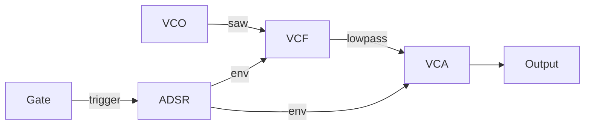

# Your First Patch

Let's build a complete synthesizer voice: an oscillator through a filter, shaped by an envelope. This is the classic subtractive synthesis signal path.



## The Complete Example

```rust,ignore
{{#include ../../../examples/first_patch.rs}}
```

## Understanding the Code

### Creating a Patch

```rust,ignore
let mut patch = Patch::new(44100.0);
```

The `Patch` is your virtual modular case. The sample rate (44100 Hz = CD quality) determines timing precision for all modules.

### Adding Modules

```rust,ignore
let vco = patch.add("vco", Vco::new(44100.0));
let vcf = patch.add("vcf", Svf::new(44100.0));
```

Each module gets a unique name and returns a `NodeHandle`. This handle lets you reference the module's ports.

### Making Connections

```rust,ignore
patch.connect(vco.out("saw"), vcf.in_("in")).unwrap();
```

The syntax mirrors real patching:
- `vco.out("saw")` — the sawtooth output jack
- `vcf.in_("in")` — the filter's audio input jack

> **Note:** We use `in_()` instead of `in()` because `in` is a Rust keyword.

### Compiling the Patch

```rust,ignore
patch.set_output(output.id());
patch.compile().unwrap();
```

Compilation:
1. Performs topological sort (determines processing order)
2. Validates all connections
3. Detects any cycles (feedback loops)

### Processing Audio

```rust,ignore
let (left, right) = patch.tick();
```

Each `tick()` advances the patch by one sample, returning stereo output.

## Signal Flow in Detail

| Stage | Module | Function |
|-------|--------|----------|
| 1 | VCO | Generates raw waveform (saw wave) |
| 2 | VCF | Filters harmonics (lowpass) |
| 3 | VCA | Controls amplitude |
| 4 | ADSR | Shapes volume over time |
| 5 | Output | Routes to stereo outputs |

The envelope simultaneously controls:
- **Filter cutoff** — brighter attack, darker sustain
- **VCA level** — shapes volume contour

This dual modulation creates the characteristic "filter sweep" sound of analog synths.

## What's Happening Mathematically

The signal chain computes:

$$\text{output}(t) = \text{env}(t) \cdot \text{LPF}(\text{saw}(t), \text{env}(t) \cdot f_c)$$

Where:
- $\text{saw}(t)$ is the sawtooth oscillator at time $t$
- $\text{LPF}$ is the lowpass filter
- $\text{env}(t)$ is the envelope value
- $f_c$ is the base cutoff frequency

The envelope modulating both the filter and amplitude creates the classic synth timbre.

## Experimenting

Try these modifications:

1. **Different waveform**: Change `vco.out("saw")` to `vco.out("sqr")` for a hollow, clarinet-like tone

2. **Add an LFO**: Modulate the filter for a rhythmic wobble

3. **Change envelope times**: Longer attack for pads, shorter for percussion

---

Next: [Understanding Signal Flow](./signal-flow.md)
