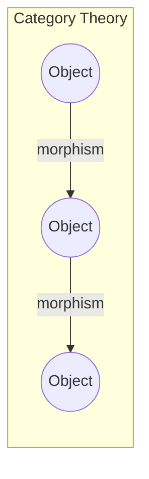
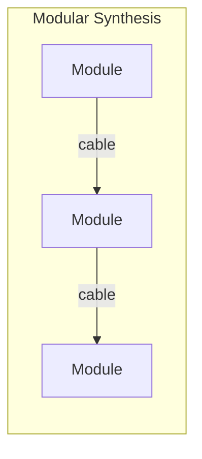
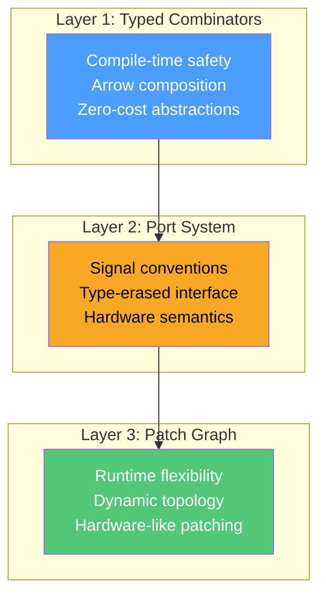
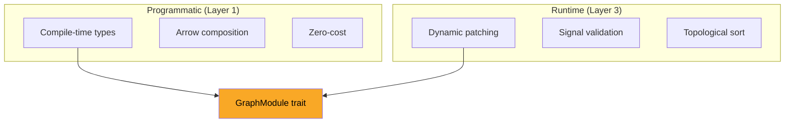

# The Quiver Philosophy

Quiver isn't just another DSP library. It's built on a philosophy that bridges abstract mathematics with hands-on synthesis.

## The Name

A **quiver** in category theory is a directed graph—a collection of objects connected by arrows. This is exactly what a modular synthesizer is:





The parallel is precise:
- **Objects** → Modules (signal processors)
- **Morphisms/Arrows** → Patch cables (signal flow)
- **Composition** → Signal chaining
- **Identity** → Pass-through modules

This isn't mere analogy—it guides the entire API design.

## Three Layers, One System

Quiver's architecture reflects different levels of abstraction:



### Layer 1: Mathematical Purity

At the foundation, modules are **Arrow combinators**:

```rust,ignore
// Sequential composition: f >>> g
let chain = osc.chain(filter);

// Parallel composition: f *** g
let stereo = left.parallel(right);

// Fanout: f &&& g
let split = signal.fanout(fx1, fx2);
```

These operations are type-checked at compile time. If types don't match, the program doesn't compile.

**Arrow Laws** hold:
$$\text{id} \ggg f = f = f \ggg \text{id}$$
$$(f \ggg g) \ggg h = f \ggg (g \ggg h)$$

### Layer 2: Hardware Semantics

The port system brings real-world meaning:

- **±5V audio** because that's what mixers expect
- **1V/octave** because that's the pitch standard
- **Gates and triggers** because that's how sequencers work

This layer ensures your patches behave like hardware.

### Layer 3: Patching Freedom

The graph layer gives runtime flexibility:

```rust,ignore
// Add modules dynamically
let new_lfo = patch.add("wobble", Lfo::new(44100.0));

// Connect at runtime
patch.connect(new_lfo.out("sin"), vcf.in_("cutoff"))?;

// Recompile and continue
patch.compile()?;
```

This is how real modular synthesizers work—you can repatch while playing.

## Design Principles

### 1. Type Safety Where It Matters

Quiver catches errors at compile time when possible:

```rust,ignore
// This won't compile: f64 can't go where (f64, f64) is expected
let bad_chain = mono_module.chain(stereo_module);
```

But it allows runtime flexibility when needed:

```rust,ignore
// This works: runtime type checking with clear error messages
patch.connect(vco.out("saw"), vcf.in_("cutoff"))
    .expect("Signal type mismatch");
```

### 2. Zero-Cost Abstractions

Layer 1 combinators compile to the same code as hand-written loops:

```rust,ignore
// This combinator chain...
let synth = vco.chain(vcf).chain(vca);

// ...compiles to equivalent of:
fn tick(&mut self) -> f64 {
    self.vca.tick(self.vcf.tick(self.vco.tick(())))
}
```

The abstraction is free—no runtime overhead.

### 3. Hardware-Inspired Defaults

Modules behave like their analog counterparts:

- VCO starts at C4 (0V = 261.63 Hz)
- ADSR has sensible attack/decay/sustain/release
- Filter resonance ranges from clean to self-oscillation

You can start patching immediately without configuring everything.

### 4. Progressive Complexity

Simple things are simple:

```rust,ignore
let output = vco.chain(output);  // One line, done
```

Complex things are possible:

```rust,ignore
// Polyphonic patch with unison, analog modeling, SIMD processing
let poly = PolyPatch::new(voices, voice_patch)
    .with_unison(UnisonConfig::new(3).with_detune(0.1))
    .with_analog_variation(ComponentModel::default());
```

## The Hybrid Approach

Most DSP libraries force a choice:
- **Static**: Great types, but can't repatch at runtime
- **Dynamic**: Flexible, but crashes at runtime on type errors

Quiver offers both:



Write your core DSP with full type safety, then expose it to the graph system for flexible routing.

## Mathematical Foundations

The math isn't decoration—it ensures correctness:

| Property | Musical Meaning |
|----------|----------------|
| **Associativity** | Grouping doesn't affect sound |
| **Identity** | Pass-through doesn't color signal |
| **Composition** | Chaining is predictable |
| **Functor laws** | Signal mapping is consistent |

When you chain modules, you're performing mathematical composition. The laws guarantee the result is what you expect.

## Why This Matters

1. **Fewer bugs**: Type system catches connection errors
2. **Better performance**: Zero-cost abstractions
3. **Clearer thinking**: Math clarifies design
4. **Hardware familiarity**: Patches work like real modulars

Quiver aims to be the missing link between academic DSP theory and hands-on synthesis. The math makes it reliable; the hardware semantics make it intuitive.

---

Ready to dive deeper? Continue to [Tutorials](../tutorials/subtractive-synthesis.md).
