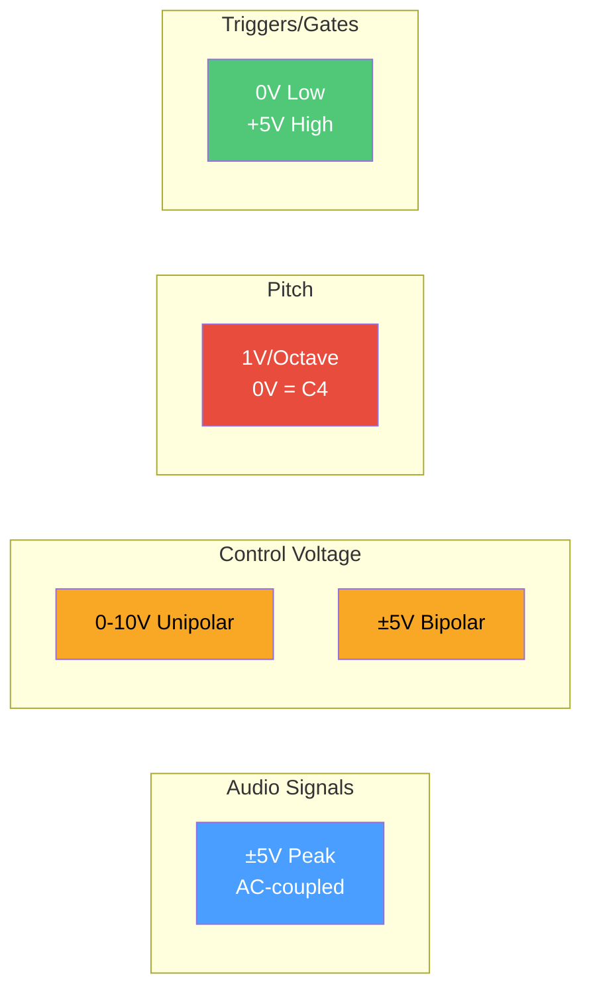
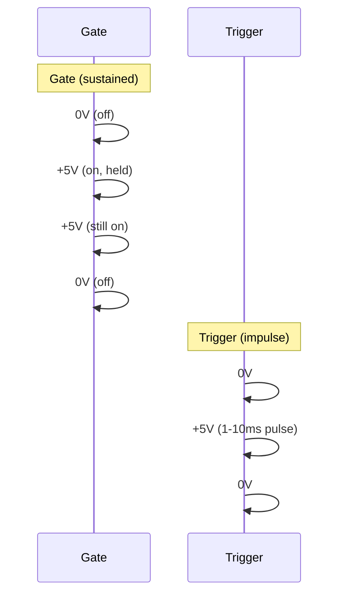
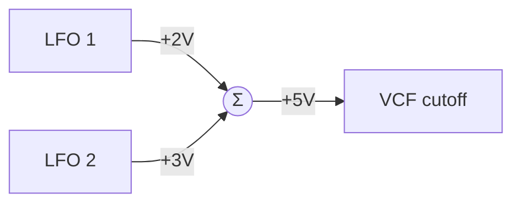
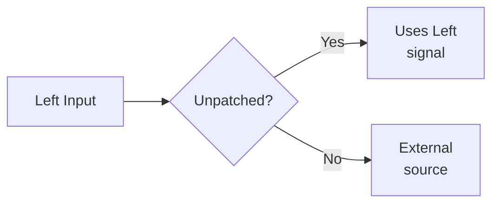
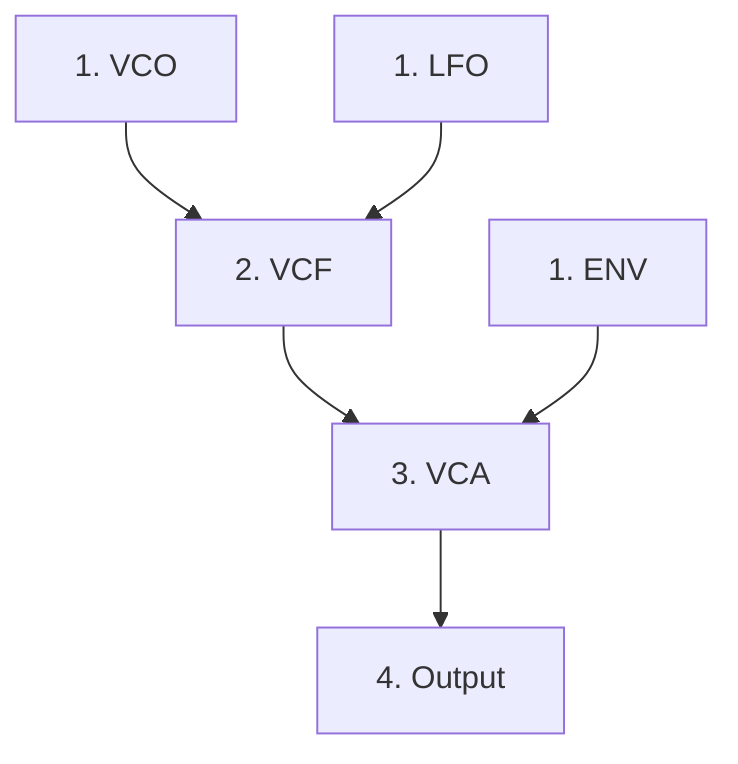
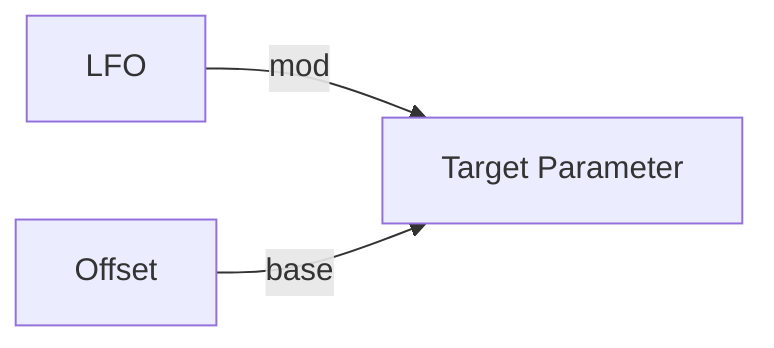
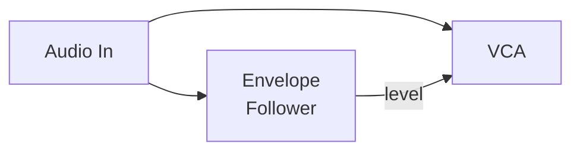
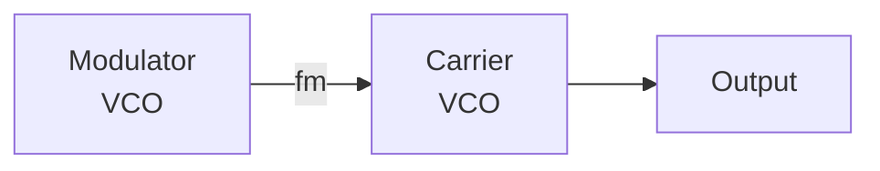

# Understanding Signal Flow

In Quiver, signals flow through modules following the conventions of hardware modular synthesizers. Understanding these conventions is key to creating patches that behave predictably.

## Voltage Ranges

Quiver models its signals on the Eurorack standard:



### Audio Signals

Audio oscillates between **-5V and +5V**:

$$\text{audio}(t) \in [-5, +5]$$

This matches Eurorack levels and allows headroom for mixing.

### Control Voltage (CV)

Two types of control voltage:

| Type | Range | Use Case |
|------|-------|----------|
| **Unipolar** | 0V to +10V | Filter cutoff, LFO rate, envelope times |
| **Bipolar** | -5V to +5V | Vibrato, pan position, FM |

### Volt-per-Octave (V/Oct)

Pitch follows the **1 Volt per Octave** standard:

$$f = f_0 \cdot 2^{V}$$

Where $f_0 = 261.63$ Hz (C4) at 0V.

| Voltage | Note | Frequency |
|---------|------|-----------|
| -1V | C3 | 130.81 Hz |
| 0V | C4 | 261.63 Hz |
| +1V | C5 | 523.25 Hz |
| +2V | C6 | 1046.50 Hz |

### Gates and Triggers



- **Gate**: Sustained high signal (key held down)
- **Trigger**: Brief pulse (≈1-10ms) to start events

## Signal Types in Code

Quiver tracks signal types through `SignalKind`:

```rust,ignore
pub enum SignalKind {
    Audio,           // ±5V AC-coupled
    CvBipolar,       // ±5V control
    CvUnipolar,      // 0-10V control
    VoltPerOctave,   // 1V/Oct pitch
    Gate,            // 0V or +5V sustained
    Trigger,         // 0V or +5V brief pulse
    Clock,           // Regular timing pulses
}
```

The type system helps catch mismatches:

```rust,ignore
// This will warn: connecting audio to a V/Oct input
patch.connect(vco.out("saw"), another_vco.in_("voct"))
```

## Module Input Behavior

### Input Summing

Multiple cables to one input are **summed**:



This models analog behavior where multiple CVs combine.

### Attenuverters

Many inputs support attenuation and inversion:

```rust,ignore
// Half strength, inverted
patch.connect_with(
    lfo.out("sin"),
    vcf.in_("cutoff"),
    Cable::new().with_attenuation(-0.5),
)?;
```

The attenuverter range is typically **-2 to +2**, allowing inversion and some gain.

### Normalled Connections

Some inputs have default sources when unpatched:



The `StereoOutput` module, for example, normalizes right to left if right is unpatched.

## Processing Order

Quiver automatically determines processing order through topological sort:



Modules with no dependencies process first. The algorithm (Kahn's) ensures every module has its inputs ready before processing.

## Common Patching Patterns

### Modulation



Combine a static offset with an LFO for "center + modulation" control.

### Envelope Following



Use audio amplitude to control other parameters.

### FM (Frequency Modulation)



Audio-rate modulation of oscillator frequency creates complex timbres.

---

Next: [The Quiver Philosophy](./philosophy.md)
