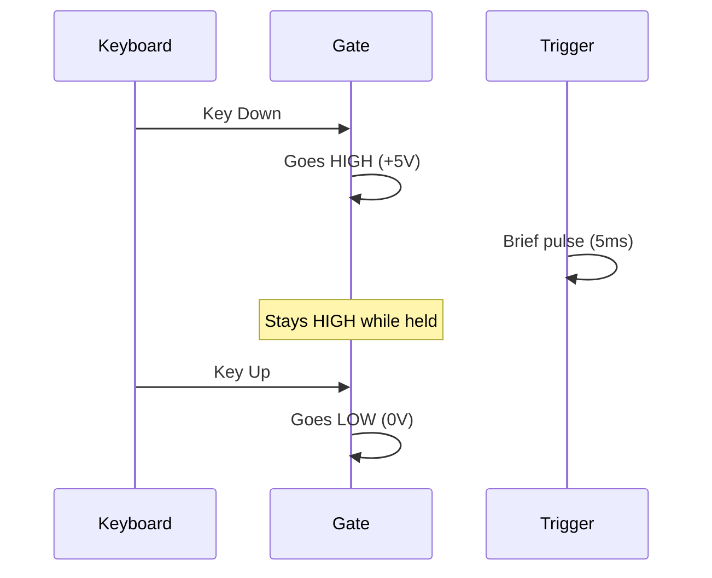

# Use External MIDI

Connect your Quiver patches to MIDI keyboards, controllers, and DAWs.

## The AtomicF64 Bridge

MIDI events arrive on a separate thread. Use `AtomicF64` for thread-safe communication:

```rust,ignore
use std::sync::Arc;
use quiver::prelude::*;

// Create shared atomic values
let pitch = Arc::new(AtomicF64::new(0.0));  // V/Oct
let gate = Arc::new(AtomicF64::new(0.0));   // Gate signal
let mod_wheel = Arc::new(AtomicF64::new(0.0)); // CC1

// Clone for MIDI thread
let pitch_midi = Arc::clone(&pitch);
let gate_midi = Arc::clone(&gate);
```

## ExternalInput Module

Inject atomic values into your patch:

```rust,ignore
let pitch_in = patch.add("pitch", ExternalInput::voct(Arc::clone(&pitch)));
let gate_in = patch.add("gate", ExternalInput::gate(Arc::clone(&gate)));

patch.connect(pitch_in.out("out"), vco.in_("voct"))?;
patch.connect(gate_in.out("out"), env.in_("gate"))?;
```

ExternalInput variants:

| Factory Method | Signal Type | Range |
|----------------|-------------|-------|
| `::voct()` | V/Oct pitch | ±10V |
| `::gate()` | Gate | 0-5V |
| `::trigger()` | Trigger | 0-5V |
| `::cv()` | Unipolar CV | 0-10V |
| `::cv_bipolar()` | Bipolar CV | ±5V |

## MIDI to V/Oct Conversion

Standard conversion:

```rust,ignore
fn midi_note_to_voct(note: u8) -> f64 {
    (note as f64 - 60.0) / 12.0
}

// In your MIDI handler:
pitch_midi.set(midi_note_to_voct(note_number));
```

| MIDI Note | V/Oct |
|-----------|-------|
| 36 (C2) | -2.0V |
| 48 (C3) | -1.0V |
| 60 (C4) | 0.0V |
| 72 (C5) | +1.0V |

## MidiState Helper

For more complete MIDI handling:

```rust,ignore
let midi_state = MidiState::new();

// In MIDI callback:
midi_state.note_on(60, 100);  // Note 60, velocity 100
midi_state.note_off(60);
midi_state.control_change(1, 64);  // Mod wheel to 50%

// Read current state:
let current_voct = midi_state.voct();
let current_gate = midi_state.gate();
let mod_value = midi_state.cc(1);
```

## Example: Complete MIDI Integration

```rust,ignore
{{#include ../../../examples/howto_midi.rs}}
```

## Gate vs Trigger



- **Gate**: Stays high while key held (for sustain)
- **Trigger**: Brief pulse at note start (for percussion)

## Velocity Mapping

Convert MIDI velocity (0-127) to CV:

```rust,ignore
fn velocity_to_cv(velocity: u8) -> f64 {
    velocity as f64 / 127.0 * 10.0  // 0-10V range
}
```

Route to VCA for dynamics:

```rust,ignore
let velocity_in = patch.add("vel", ExternalInput::cv(vel_atomic));
patch.connect(velocity_in.out("out"), vca.in_("cv"))?;
```

## Pitch Bend

Pitch bend is typically ±2 semitones:

```rust,ignore
fn pitch_bend_to_voct(bend: i16) -> f64 {
    // bend: -8192 to +8191
    // Result: ±2 semitones = ±(2/12) V = ±0.167V
    (bend as f64 / 8192.0) * (2.0 / 12.0)
}
```

Sum with note pitch:

```rust,ignore
let total_pitch = note_voct + bend_voct;
pitch_atomic.set(total_pitch);
```

## Thread Safety Notes

- `AtomicF64` uses relaxed ordering—fine for audio
- Updates are lock-free (no blocking)
- Read the latest value, never stale data
