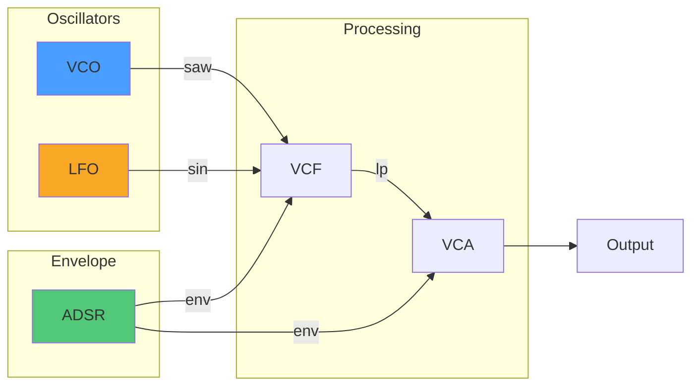

# Visualize Your Patch

Quiver provides tools to visualize patch topology and analyze signals.

## DOT/GraphViz Export

Generate visual diagrams of your patch:

```rust,ignore
use quiver::prelude::*;

let patch = /* your patch */;

// Create exporter with default style
let exporter = DotExporter::new(&patch);
let dot = exporter.to_dot();

println!("{}", dot);
```

Save to file and render:

```bash
# Save DOT output
cargo run > patch.dot

# Render with GraphViz
dot -Tpng patch.dot -o patch.png
dot -Tsvg patch.dot -o patch.svg
```

## Styling Options

Customize the visualization:

```rust,ignore
let style = DotStyle::new()
    .with_theme("dark")          // dark, light, minimal
    .with_rankdir("LR")          // LR (left-right) or TB (top-bottom)
    .with_show_port_names(true)
    .with_signal_colors(true);   // Color-code by signal type

let exporter = DotExporter::with_style(&patch, style);
```

Signal type colors:
- **Audio**: Blue
- **CV**: Orange
- **Gate/Trigger**: Green
- **V/Oct**: Red

## Example Output



## Oscilloscope

Monitor signals in real-time:

```rust,ignore
let scope = Scope::new(44100.0)
    .with_buffer_size(1024)
    .with_trigger_mode(TriggerMode::RisingEdge);

// In your audio loop
let sample = patch.tick().0;
scope.write(sample);

// Get waveform for display
let waveform = scope.buffer();
```

Trigger modes:
- `Free`: Continuous display
- `RisingEdge`: Trigger on positive zero-crossing
- `FallingEdge`: Trigger on negative zero-crossing
- `Single`: One-shot capture

## Spectrum Analyzer

View frequency content:

```rust,ignore
let analyzer = SpectrumAnalyzer::new(44100.0);

// Feed samples
for sample in samples.iter() {
    analyzer.write(*sample);
}

// Get spectrum data
let bins = analyzer.bins();        // Frequency bins
let magnitudes = analyzer.magnitudes();  // dB values

// Find dominant frequency
let peak_freq = analyzer.peak_frequency();
println!("Fundamental: {:.1} Hz", peak_freq);
```

## Level Meter

Monitor audio levels:

```rust,ignore
let mut meter = LevelMeter::new(44100.0)
    .with_peak_hold(500.0);  // 500ms peak hold

// Process samples
for sample in samples.iter() {
    meter.write(*sample);
}

println!("RMS: {:.1} dB", meter.rms_db());
println!("Peak: {:.1} dB", meter.peak_db());
```

## Automation Recording

Record parameter changes:

```rust,ignore
let mut recorder = AutomationRecorder::new();

// Create a track for filter cutoff
let track_id = recorder.create_track("filter_cutoff");

// Record automation points
recorder.record(track_id, 0.0, 0.5);    // Time 0s: 0.5
recorder.record(track_id, 1.0, 0.8);    // Time 1s: 0.8
recorder.record(track_id, 2.0, 0.2);    // Time 2s: 0.2

// Get automation data
let data = recorder.data();
let json = serde_json::to_string(&data)?;
```

## Example: Complete Visualization

```rust,ignore
{{#include ../../../examples/howto_visualization.rs}}
```

## Integration with GUIs

The visualization data is designed for easy GUI integration:

```rust,ignore
// For immediate-mode GUIs (egui, imgui)
for (i, magnitude) in analyzer.magnitudes().enumerate() {
    let freq = i as f64 * sample_rate / fft_size;
    draw_bar(freq, magnitude);
}

// For retained-mode GUIs
let path: Vec<(f64, f64)> = scope.buffer()
    .enumerate()
    .map(|(i, sample)| (i as f64, *sample))
    .collect();
draw_path(&path);
```
