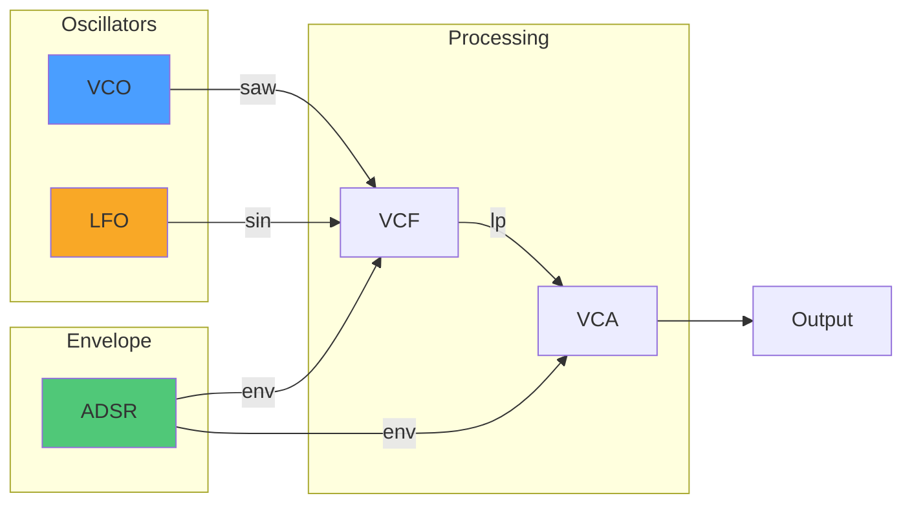

# Visualize Your Patch

Quiver provides tools to visualize patch topology and analyze signals. These
are standalone helpers, not graph modules—you feed them samples from
`patch.tick()` rather than patching them into the graph.

## DOT/GraphViz Export

Generate visual diagrams of your patch:

```rust,ignore
use quiver::prelude::*;

let patch = /* your patch */;

// Export with the default (dark) style
let dot = DotExporter::export_default(&patch);
println!("{}", dot);

// Or pass an explicit style
let style = DotStyle::default();
let dot = DotExporter::export(&patch, &style);
```

Save to file and render:

```bash
# Save DOT output
cargo run > patch.dot

# Render with GraphViz
dot -Tpng patch.dot -o patch.png
dot -Tsvg patch.dot -o patch.svg
```

## Styling Options

`DotStyle` has preset constructors and a couple of builder methods:

```rust,ignore
// Presets: default() is a dark theme
let style = DotStyle::light();      // Light theme
let style = DotStyle::minimal();    // No port names, no signal colors

// Builders
let style = DotStyle::default()
    .with_rankdir("LR")             // LR, TB, BT, RL
    .with_node_shape("box");

// All fields are public for full control
let style = DotStyle {
    show_port_names: true,
    color_by_signal: true,          // Color-code edges by signal type
    ..DotStyle::default()
};
```

Signal type colors:
- **Audio**: Blue
- **CV**: Orange
- **Gate/Trigger**: Green
- **V/Oct**: Red

## Example Output


```mermaid
flowchart LR
    subgraph Oscillators
        VCO[VCO]
        LFO[LFO]
    end

    subgraph Processing
        VCF[VCF]
        VCA[VCA]
    end

    subgraph Envelope
        ADSR[ADSR]
    end

    VCO -->|saw| VCF
    LFO -->|sin| VCF
    VCF -->|lp| VCA
    ADSR -->|env| VCF
    ADSR -->|env| VCA
    VCA --> Output

    style VCO fill:#4a9eff
    style LFO fill:#f9a826
    style ADSR fill:#50c878
```

## Oscilloscope

Monitor signals in real-time. `Scope::new` takes the buffer size in samples;
trigger settings are configured with setters:

```rust,ignore
let mut scope = Scope::new(1024);   // Buffer size in samples
scope.set_trigger_mode(TriggerMode::RisingEdge);
scope.set_trigger_level(0.0);

// In your audio loop
let (left, _right) = patch.tick();
scope.tick(left);

// Get waveform for display
let waveform = scope.buffer_vec();          // Vec<f64>
let points = scope.get_display_data();      // Vec<(x 0.0-1.0, voltage)>
```

Trigger modes:
- `Free`: Continuous display
- `RisingEdge`: Trigger on positive crossing of the trigger level
- `FallingEdge`: Trigger on negative crossing
- `AnyEdge`: Trigger on either crossing
- `Single`: One-shot capture (buffer freezes after trigger)

## Spectrum Analyzer

View frequency content. The constructor takes the FFT size (rounded up to a
power of two) and the sample rate:

```rust,ignore
let mut analyzer = SpectrumAnalyzer::new(2048, 44100.0);
analyzer.set_smoothing(0.8);        // 0.0 = none, up to 0.99

// Feed samples; the spectrum recomputes each time the buffer fills
for sample in samples.iter() {
    analyzer.tick(*sample);
}

// Get (frequency_hz, magnitude_db) pairs
let spectrum = analyzer.get_spectrum();

// Query a specific frequency
let db_at_440 = analyzer.magnitude_at(440.0);

// Find dominant frequency
let peak_freq = analyzer.peak_frequency();
println!("Fundamental: {:.1} Hz", peak_freq);
```

## Level Meter

Monitor audio levels. All readings are in dB; peak hold defaults to 1.5
seconds and is adjusted with a setter:

```rust,ignore
let mut meter = LevelMeter::new(44100.0);
meter.set_peak_hold_time(0.5, 44100.0);  // 500ms peak hold

// Process samples
for sample in samples.iter() {
    meter.tick(*sample);
}

println!("RMS: {:.1} dB", meter.rms());
println!("Peak: {:.1} dB", meter.peak());
println!("Peak hold: {:.1} dB", meter.peak_hold());
if meter.is_clipping() {
    println!("Clipping!");
}
```

## Automation Recording

Record parameter changes over time. The recorder samples parameter values at a
configurable interval via a closure; times are in samples:

```rust,ignore
let mut recorder = AutomationRecorder::new(44100.0);
recorder.set_interval(441);              // Sample every 441 ticks (10ms)
recorder.add_track("filter_cutoff");
recorder.start();

// In your audio loop: the closure supplies the current value per track
for _ in 0..44100 {
    patch.tick();
    recorder.tick(|param_id| match param_id {
        "filter_cutoff" => Some(current_cutoff),
        _ => None,
    });
}

recorder.stop();

// Inspect or export
if let Some(track) = recorder.get_track("filter_cutoff") {
    println!("Duration: {:.2}s", track.duration_seconds());
    let value = track.value_at(22050);   // Interpolated value at sample 22050
}

let data = recorder.export();            // AutomationData (serde-serializable)
let json = serde_json::to_string(&data)?;
```

You can also build tracks by hand with `AutomationTrack::new(param_id,
sample_rate)` and `track.record(time_in_samples, value)`, then thin dense data
with `simplify(tolerance)`.

## Example: Complete Visualization

```rust,ignore
{{#include ../../../examples/howto_visualization.rs}}
```

## Integration with GUIs

The visualization data is designed for easy GUI integration:

```rust,ignore
// For immediate-mode GUIs (egui, imgui)
for (freq, magnitude_db) in analyzer.get_spectrum() {
    draw_bar(freq, magnitude_db);
}

// For retained-mode GUIs
let path: Vec<(f64, f64)> = scope.get_display_data();
draw_path(&path);
```
