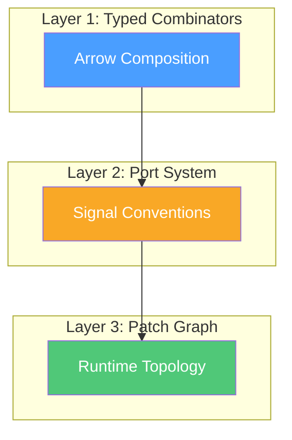

# Quiver: Modular Audio Synthesis

> *"A quiver is a directed graph — nodes connected by arrows. In audio, our nodes are modules, our arrows are patch cables, and signal flows through their composition."*

**Quiver** is a Rust library for building modular audio synthesis systems. It combines the mathematical elegance of category theory with the tactile joy of patching a hardware modular synthesizer.

<div class="quiver-explorable" data-viz="patchgraph">
<script type="application/json">
{
  "modules": [
    {"id": "vco", "label": "VCO", "x": 0, "y": 0,
     "inputs": [{"name": "voct", "kind": "voct"}],
     "outputs": [{"name": "saw", "kind": "audio"}]},
    {"id": "gate", "label": "GATE", "x": 0, "y": 3.2,
     "outputs": [{"name": "out", "kind": "gate"}]},
    {"id": "vcf", "label": "VCF", "x": 1, "y": 0,
     "inputs": [{"name": "in", "kind": "audio"}, {"name": "cutoff", "kind": "cv"}],
     "outputs": [{"name": "lp", "kind": "audio"}]},
    {"id": "adsr", "label": "ADSR", "x": 1, "y": 3.2,
     "inputs": [{"name": "gate", "kind": "gate"}],
     "outputs": [{"name": "env", "kind": "cv"}]},
    {"id": "vca", "label": "VCA", "x": 2, "y": 0,
     "inputs": [{"name": "in", "kind": "audio"}, {"name": "cv", "kind": "cv"}],
     "outputs": [{"name": "out", "kind": "audio"}]},
    {"id": "out", "label": "OUTPUT", "x": 3, "y": 0,
     "inputs": [{"name": "left", "kind": "audio"}]}
  ],
  "cables": [
    {"from": "vco.saw", "to": "vcf.in", "kind": "audio"},
    {"from": "gate.out", "to": "adsr.gate", "kind": "gate"},
    {"from": "vcf.lp", "to": "vca.in", "kind": "audio"},
    {"from": "adsr.env", "to": "vcf.cutoff", "kind": "cv"},
    {"from": "adsr.env", "to": "vca.cv", "kind": "cv"},
    {"from": "vca.out", "to": "out.left", "kind": "audio"}
  ],
  "caption": "The canonical subtractive voice: audio flows VCO → VCF → VCA while one envelope shapes both timbre and loudness."
}
</script>
</div>

*Diagrams like this one are backed by live, hearable versions — [start with the Explorables](./explorables/index.md). Or patch the real compiled engine right now in the [Live Playground](./playground.md).*

## Why Quiver?

### Type-Safe Patching

Quiver catches connection errors at compile time. Connect a gate to a V/Oct input? The type system prevents it before you hear a single pop.

### Hardware-Inspired Semantics

Voltages follow real modular conventions:
- **±5V** for audio signals
- **1V/octave** for pitch (0V = C4)
- **0-5V** for gates and triggers
- **0-10V** for unipolar CV

### Mathematical Foundations

Built on **Arrow-style functional combinators**, Quiver lets you compose DSP operations like mathematical functions:

\\[ f \ggg g = g \circ f \\]

Chain two modules and their types compose automatically.

### Three-Layer Architecture


```mermaid
graph TB
    subgraph "Layer 3: Patch Graph"
        G[Runtime Topology]
    end
    subgraph "Layer 2: Port System"
        P[Signal Conventions]
    end
    subgraph "Layer 1: Typed Combinators"
        C[Arrow Composition]
    end

    C --> P --> G

    style C fill:#4a9eff,color:#fff
    style P fill:#f9a826,color:#fff
    style G fill:#50c878,color:#fff
```

1. **Layer 1** — Compile-time type checking with zero-cost abstractions
2. **Layer 2** — Hardware-inspired signal conventions
3. **Layer 3** — Runtime-configurable patching like a real modular

## Quick Taste

```rust,ignore
{{#include ../../examples/quick_taste.rs}}
```

Run it with `cargo run --example quick_taste`—it writes
`target/quick_taste.wav`, so you can hear the result in any audio player. For
a fuller sequenced phrase rendered to disk, see
`cargo run --example render_wav` and the
[Render Offline to WAV](./how-to/render-wav.md) guide.

## What You'll Learn

This documentation guides you from first patch to advanced synthesis:

- **[Getting Started](./getting-started/installation.md)** — Install and build your first sound
- **[Tutorials](./tutorials/subtractive-synthesis.md)** — Progressive lessons in synthesis
- **[How-To Guides](./how-to/connect-modules.md)** — Task-focused recipes
- **[Concepts](./concepts/architecture.md)** — Deep dives into theory
- **[Reference](./reference/oscillators.md)** — Complete module documentation

## The Name

In category theory, a **quiver** is a directed graph: objects connected by morphisms. In our world:

| Category Theory | Quiver Audio |
|-----------------|--------------|
| Objects | Modules |
| Morphisms (Arrows) | Patch Cables |
| Composition | Signal Flow |
| Identity | Pass-through |

The math isn't just decoration—it guides the API design and ensures compositions are well-typed.

---

Ready to patch? Start with [Installation](./getting-started/installation.md).
