# Quiver: Modular Audio Synthesis

> *"A quiver is a directed graph — nodes connected by arrows. In audio, our nodes are modules, our arrows are patch cables, and signal flows through their composition."*

**Quiver** is a Rust library for building modular audio synthesis systems. It combines the mathematical elegance of category theory with the tactile joy of patching a hardware modular synthesizer.

```mermaid
flowchart LR
    subgraph "Oscillator"
        VCO[🎵 VCO]
    end
    subgraph "Filter"
        VCF[📊 VCF]
    end
    subgraph "Amplifier"
        VCA[🔊 VCA]
    end
    subgraph "Envelope"
        ADSR[📈 ADSR]
    end

    VCO -->|saw| VCF
    VCF -->|lowpass| VCA
    ADSR -->|env| VCF
    ADSR -->|env| VCA
    VCA --> Output[🔈]
```



## Why Quiver?

### Type-Safe Patching

Quiver catches connection errors at compile time. Connect a gate to a V/Oct input? The type system prevents it before you hear a single pop.

### Hardware-Inspired Semantics

Voltages follow real modular conventions:
- **±5V** for audio signals
- **1V/octave** for pitch (0V = C4)
- **0-5V** for gates and triggers
- **0-10V** for unipolar CV

### Mathematical Foundations

Built on **Arrow-style functional combinators**, Quiver lets you compose DSP operations like mathematical functions:

$$f \ggg g = g \circ f$$

Chain two modules and their types compose automatically.

### Three-Layer Architecture


1. **Layer 1** — Compile-time type checking with zero-cost abstractions
2. **Layer 2** — Hardware-inspired signal conventions
3. **Layer 3** — Runtime-configurable patching like a real modular

## Quick Taste

```rust,ignore
{{#include ../../examples/quick_taste.rs}}
```

## What You'll Learn

This documentation guides you from first patch to advanced synthesis:

- **[Getting Started](./getting-started/installation.md)** — Install and build your first sound
- **[Tutorials](./tutorials/subtractive-synthesis.md)** — Progressive lessons in synthesis
- **[How-To Guides](./how-to/connect-modules.md)** — Task-focused recipes
- **[Concepts](./concepts/architecture.md)** — Deep dives into theory
- **[Reference](./reference/oscillators.md)** — Complete module documentation

## The Name

In category theory, a **quiver** is a directed graph: objects connected by morphisms. In our world:

| Category Theory | Quiver Audio |
|-----------------|--------------|
| Objects | Modules |
| Morphisms (Arrows) | Patch Cables |
| Composition | Signal Flow |
| Identity | Pass-through |

The math isn't just decoration—it guides the API design and ensures compositions are well-typed.

---

Ready to patch? Start with [Installation](./getting-started/installation.md).
