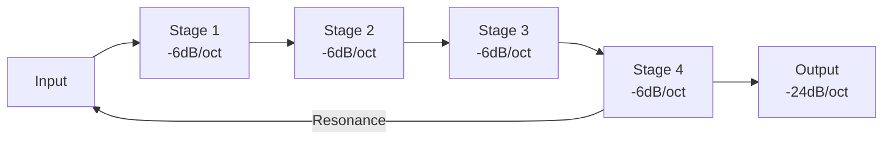

# Filters

Filters shape the harmonic content of sound by attenuating certain frequencies while passing others.

## SVF (State-Variable Filter)

A versatile 12dB/octave filter with multiple simultaneous outputs.

```rust,ignore
let vcf = patch.add("vcf", Svf::new(44100.0));
```

### Inputs

| Port | Signal | Range | Description |
|------|--------|-------|-------------|
| `in` | Audio | ±5V | Audio input |
| `cutoff` | Unipolar CV | 0-10V | Cutoff frequency |
| `resonance` | Unipolar CV | 0-10V | Resonance/Q (0-1) |
| `fm` | Bipolar CV | ±5V | Frequency modulation |
| `tracking` | V/Oct | ±10V | Keyboard tracking |

### Outputs

| Port | Signal | Description |
|------|--------|-------------|
| `lp` | Audio | Lowpass (removes highs) |
| `bp` | Audio | Bandpass (passes band) |
| `hp` | Audio | Highpass (removes lows) |
| `notch` | Audio | Notch (removes band) |

### Transfer Functions

**Lowpass:**
$$H_{LP}(s) = \frac{\omega_c^2}{s^2 + \frac{\omega_c}{Q}s + \omega_c^2}$$

**Highpass:**
$$H_{HP}(s) = \frac{s^2}{s^2 + \frac{\omega_c}{Q}s + \omega_c^2}$$

**Bandpass:**
$$H_{BP}(s) = \frac{\frac{\omega_c}{Q}s}{s^2 + \frac{\omega_c}{Q}s + \omega_c^2}$$

### Cutoff Mapping

| CV | Frequency |
|----|-----------|
| 0V | 20 Hz |
| 5V | ~630 Hz |
| 10V | 20,000 Hz |

### Resonance Behavior

| Resonance | Character |
|-----------|-----------|
| 0.0 | Flat response |
| 0.5 | Slight peak |
| 0.9 | Prominent peak |
| 0.95+ | Self-oscillation |

At high resonance, the filter produces a sine wave at the cutoff frequency.

---

## DiodeLadderFilter

Classic 24dB/octave ladder filter with diode saturation modeling.

```rust,ignore
let ladder = patch.add("filter", DiodeLadderFilter::new(44100.0));
```

### Inputs

| Port | Signal | Description |
|------|--------|-------------|
| `in` | Audio | Audio input |
| `cutoff` | Unipolar CV | Cutoff frequency |
| `resonance` | Unipolar CV | Resonance (0-1) |
| `drive` | Unipolar CV | Saturation amount |

### Output

| Port | Signal | Description |
|------|--------|-------------|
| `out` | Audio | Filtered output |

### Characteristics

- 24dB/octave slope (4-pole)
- Diode saturation per stage
- Warm, slightly dirty character
- Resonance with bass loss (like original Moog)

### The Ladder Topology



---

## Filter Modulation Techniques

### Envelope → Filter

Classic brightness sweep:

```rust,ignore
patch.connect(env.out("env"), vcf.in_("cutoff"))?;
// Fast decay = plucky, slow decay = pad
```

### LFO → Filter

Rhythmic movement:

```rust,ignore
patch.connect(lfo.out("sin"), vcf.in_("fm"))?;
```

### Keyboard Tracking

Higher notes = higher cutoff:

```rust,ignore
patch.connect(pitch.out("out"), vcf.in_("tracking"))?;
// 100% tracking: cutoff follows pitch
```

### Audio-Rate FM

Metallic/vocal effects:

```rust,ignore
// Use oscillator as modulation source
patch.connect(vco2.out("sin"), vcf.in_("fm"))?;
```

---

## Response Curves

```
dB
 0 ├──────────────┐
   │               ╲
-6 ├                ╲
   │                 ╲ LP
-12├                  ╲
   │                   ╲
-24├                    ╲
   └────────────────────────
           fc          Frequency
```

## Common Settings

| Sound | Cutoff | Resonance | Notes |
|-------|--------|-----------|-------|
| **Warm bass** | Low | Low | Full body |
| **Acid squelch** | Swept | High | TB-303 style |
| **Vocal formant** | Mid | High | Vowel-like |
| **Bright lead** | High | Medium | Cutting |
| **Underwater** | Very low | Low | Muffled |
