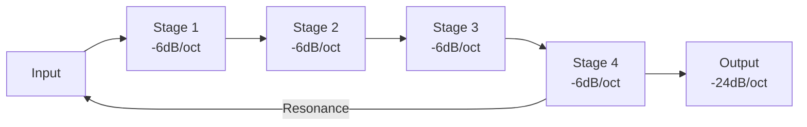

# Filters

Filters shape the harmonic content of sound by attenuating certain frequencies while passing others.

## SVF (State-Variable Filter)

A versatile 12dB/octave TPT / zero-delay-feedback (ZDF) filter with four simultaneous outputs and stable self-oscillation. `type_id`: `svf`.

```rust,ignore
let vcf = patch.add("vcf", Svf::new(44100.0));
```

### Inputs

| Port | Signal | Range | Description |
|------|--------|-------|-------------|
| `in` | Audio | ±5V | Audio input |
| `cutoff` | Unipolar CV | 0-10V | Cutoff frequency (20 Hz–20 kHz, exponential) |
| `res` | Unipolar CV | 0-10V | Resonance (0–1) |
| `fm` | Bipolar CV | ±5V | Linear FM added to cutoff |
| `keytrack` | V/Oct | ±5V | Keyboard tracking pitch |
| `keytrack_amt` | Unipolar CV | 0-10V | Keyboard tracking amount (0–1) |

### Outputs

| Port | Signal | Description |
|------|--------|-------------|
| `lp` | Audio | Lowpass (removes highs) |
| `bp` | Audio | Bandpass (passes band) |
| `hp` | Audio | Highpass (removes lows) |
| `notch` | Audio | Notch (removes band) |

### Transfer Functions

**Lowpass:**
\\[ H_{LP}(s) = \frac{\omega_c^2}{s^2 + \frac{\omega_c}{Q}s + \omega_c^2} \\]

**Highpass:**
\\[ H_{HP}(s) = \frac{s^2}{s^2 + \frac{\omega_c}{Q}s + \omega_c^2} \\]

**Bandpass:**
\\[ H_{BP}(s) = \frac{\frac{\omega_c}{Q}s}{s^2 + \frac{\omega_c}{Q}s + \omega_c^2} \\]

### Cutoff Mapping

| CV | Frequency |
|----|-----------|
| 0V | 20 Hz |
| 5V | ~630 Hz |
| 10V | 20,000 Hz |

### Resonance Behavior

Resonance sets the ZDF damping factor `k = 2 − 2·res`: `res = 0` gives `k = 2` (Q ≈ 0.5),
and `res → 1` drives `k → 0` (near-infinite Q). Integrator states are soft-clipped, so
high resonance self-oscillates as a **slow-decay sine ring** at the cutoff frequency
rather than blowing up.

| Resonance | Character |
|-----------|-----------|
| 0.0 | Flat response |
| 0.5 | Slight peak |
| 0.9 | Prominent peak |
| 1.0 | Self-oscillation (slow-decay ring) |

---

## DiodeLadderFilter

Classic 24dB/octave (4-pole) TB-303/Moog-style ladder filter with diode saturation. `type_id`: `diode_ladder`.

```rust,ignore
let ladder = patch.add("filter", DiodeLadderFilter::new(44100.0));
```

### Inputs

| Port | Signal | Range | Description |
|------|--------|-------|-------------|
| `in` | Audio | ±5V | Audio input |
| `cutoff` | Unipolar CV | 0-10V | Cutoff frequency (20 Hz–20 kHz, exponential) |
| `res` | Unipolar CV | 0-10V | Resonance (0–1; feedback `k = res·4`) |
| `fm` | Bipolar CV | ±5V | Linear FM added to cutoff |
| `keytrack` | V/Oct | ±5V | Keyboard tracking pitch |
| `keytrack_amt` | Unipolar CV | 0-10V | Keyboard tracking amount (0–1) |
| `drive` | Unipolar CV | 0-10V | Input drive (gain 1×–4×) |

### Outputs

| Port | Signal | Description |
|------|--------|-------------|
| `out` | Audio | 24 dB/oct main output |
| `pole1` | Audio | 6 dB/oct tap |
| `pole2` | Audio | 12 dB/oct tap |
| `pole3` | Audio | 18 dB/oct tap |

### Characteristics

- 24dB/octave slope (4-pole)
- Diode saturation per stage
- Warm, slightly dirty character
- Resonance with bass loss (like original Moog)

### The Ladder Topology


```mermaid
flowchart LR
    IN[Input] --> S1[Stage 1<br/>-6dB/oct]
    S1 --> S2[Stage 2<br/>-6dB/oct]
    S2 --> S3[Stage 3<br/>-6dB/oct]
    S3 --> S4[Stage 4<br/>-6dB/oct]
    S4 --> OUT[Output<br/>-24dB/oct]
    S4 -->|Resonance| IN
```

---

## ParametricEq

Three-band equalizer — low shelf, parametric mid (with Q), high shelf — using cached biquads. Each band spans ±12 dB. `type_id`: `parametric_eq`.

```rust,ignore
let eq = patch.add("eq", ParametricEq::new(44100.0));
```

### Inputs

| Port | Signal | Range | Description |
|------|--------|-------|-------------|
| `in` | Audio | ±5V | Audio input |
| `low_gain` | Bipolar CV | ±5V | Low-shelf gain (±12 dB) |
| `low_freq` | Unipolar CV | 0-10V | Low-shelf frequency (50–500 Hz) |
| `mid_gain` | Bipolar CV | ±5V | Mid peaking gain (±12 dB) |
| `mid_freq` | Unipolar CV | 0-10V | Mid frequency (200 Hz–8 kHz) |
| `mid_q` | Unipolar CV | 0-10V | Mid Q (0.5–10) |
| `high_gain` | Bipolar CV | ±5V | High-shelf gain (±12 dB) |
| `high_freq` | Unipolar CV | 0-10V | High-shelf frequency (2–12 kHz) |

### Outputs

| Port | Signal | Description |
|------|--------|-------------|
| `out` | Audio | Equalized output |

---

## Filter Modulation Techniques

### Envelope → Filter

Classic brightness sweep:

```rust,ignore
patch.connect(env.out("env"), vcf.in_("cutoff"))?;
// Fast decay = plucky, slow decay = pad
```

### LFO → Filter

Rhythmic movement:

```rust,ignore
patch.connect(lfo.out("sin"), vcf.in_("fm"))?;
```

### Keyboard Tracking

Higher notes = higher cutoff:

```rust,ignore
patch.connect(pitch.out("out"), vcf.in_("keytrack"))?;
// Set the amount (0-1) via the `keytrack_amt` input; 1.0 = cutoff follows pitch
```

### Audio-Rate FM

Metallic/vocal effects:

```rust,ignore
// Use oscillator as modulation source
patch.connect(vco2.out("sin"), vcf.in_("fm"))?;
```

---

## Response Curves

```
dB
 0 ├──────────────┐
   │               ╲
-6 ├                ╲
   │                 ╲ LP
-12├                  ╲
   │                   ╲
-24├                    ╲
   └────────────────────────
           fc          Frequency
```

## Common Settings

| Sound | Cutoff | Resonance | Notes |
|-------|--------|-----------|-------|
| **Warm bass** | Low | Low | Full body |
| **Acid squelch** | Swept | High | TB-303 style |
| **Vocal formant** | Mid | High | Vowel-like |
| **Bright lead** | High | Medium | Cutting |
| **Underwater** | Very low | Low | Muffled |
