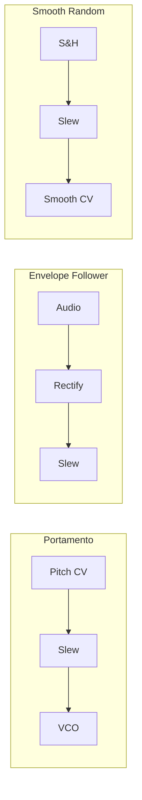

# Envelopes & Modulators

Modulation sources shape how parameters change over time, creating movement and expression.

## ADSR Envelope

The classic Attack-Decay-Sustain-Release envelope generator.

```rust,ignore
let env = patch.add("env", Adsr::new(44100.0));
```

### Inputs

| Port | Signal | Range | Description |
|------|--------|-------|-------------|
| `gate` | Gate | 0/5V | Trigger/sustain signal |
| `attack` | Unipolar CV | 0-10V | Attack time (ms-s) |
| `decay` | Unipolar CV | 0-10V | Decay time (ms-s) |
| `sustain` | Unipolar CV | 0-10V | Sustain level (0-100%) |
| `release` | Unipolar CV | 0-10V | Release time (ms-s) |

### Output

| Port | Signal | Description |
|------|--------|-------------|
| `env` | Unipolar CV | Envelope output (0-5V) |

### Envelope Stages

```
Level
  5V ┤    ╱╲
     │   ╱  ╲____
     │  ╱        ╲
     │ ╱          ╲
  0V ┼╱────────────╲────
     A    D   S    R
```

### Timing Curves

All stages use exponential curves:

**Attack:**
$$v(t) = 5 \cdot (1 - e^{-t/\tau_a})$$

**Decay/Release:**
$$v(t) = (v_{start} - v_{end}) \cdot e^{-t/\tau} + v_{end}$$

### Typical Settings

| Sound | Attack | Decay | Sustain | Release |
|-------|--------|-------|---------|---------|
| Pluck | 5ms | 200ms | 0% | 100ms |
| Pad | 1s | 500ms | 80% | 2s |
| Brass | 50ms | 100ms | 70% | 200ms |
| Perc | 1ms | 50ms | 0% | 50ms |

---

## LFO (Low-Frequency Oscillator)

See [Oscillators](./oscillators.md#lfo-low-frequency-oscillator) for full documentation.

Quick reference:

```rust,ignore
let lfo = patch.add("lfo", Lfo::new(44100.0));
patch.connect(lfo.out("sin"), vcf.in_("fm"))?;
```

---

## Sample and Hold

Captures input value on trigger pulse.

```rust,ignore
let sh = patch.add("sh", SampleAndHold::new());
```

### Inputs

| Port | Signal | Description |
|------|--------|-------------|
| `in` | CV/Audio | Signal to sample |
| `trigger` | Trigger | When to sample |

### Output

| Port | Signal | Description |
|------|--------|-------------|
| `out` | CV | Held value |

### Classic Use: Random CV

```rust,ignore
// Random stepped modulation
patch.connect(noise.out("white_left"), sh.in_("in"))?;
patch.connect(clock.out("div_8"), sh.in_("trigger"))?;
patch.connect(sh.out("out"), vcf.in_("cutoff"))?;
```

---

## Slew Limiter

Limits rate of change—creates portamento and smoothing.

```rust,ignore
let slew = patch.add("slew", SlewLimiter::new(44100.0));
```

### Inputs

| Port | Signal | Description |
|------|--------|-------------|
| `in` | CV | Input signal |
| `rise` | Unipolar CV | Rise time (upward slew) |
| `fall` | Unipolar CV | Fall time (downward slew) |

### Output

| Port | Signal | Description |
|------|--------|-------------|
| `out` | CV | Slewed output |

### Applications



---

## Quantizer

Snaps continuous CV to scale degrees.

```rust,ignore
let quant = patch.add("quant", Quantizer::new());
```

### Inputs

| Port | Signal | Description |
|------|--------|-------------|
| `in` | V/Oct | Unquantized pitch |
| `scale` | CV | Scale selection |

### Output

| Port | Signal | Description |
|------|--------|-------------|
| `out` | V/Oct | Quantized pitch |

### Available Scales

| Scale | Notes |
|-------|-------|
| Chromatic | All 12 semitones |
| Major | 1 2 3 4 5 6 7 |
| Minor | 1 2 ♭3 4 5 ♭6 ♭7 |
| Pentatonic | 1 2 3 5 6 |
| Blues | 1 ♭3 4 ♭5 5 ♭7 |

---

## Clock

Master timing generator.

```rust,ignore
let clock = patch.add("clock", Clock::new(44100.0));
```

### Inputs

| Port | Signal | Description |
|------|--------|-------------|
| `tempo` | Unipolar CV | BPM (0-10V = 20-300 BPM) |
| `reset` | Trigger | Reset to beat 1 |

### Outputs

| Port | Signal | Description |
|------|--------|-------------|
| `div_1` | Trigger | Whole notes |
| `div_2` | Trigger | Half notes |
| `div_4` | Trigger | Quarter notes |
| `div_8` | Trigger | Eighth notes |
| `div_16` | Trigger | Sixteenth notes |
| `div_32` | Trigger | 32nd notes |

---

## Step Sequencer

8-step CV/gate sequencer.

```rust,ignore
let seq = patch.add("seq", StepSequencer::new());
```

### Inputs

| Port | Signal | Description |
|------|--------|-------------|
| `clock` | Trigger | Advance to next step |
| `reset` | Trigger | Return to step 1 |

### Outputs

| Port | Signal | Description |
|------|--------|-------------|
| `cv` | V/Oct | Step CV value |
| `gate` | Gate | Step gate state |

### Programming Steps

The sequencer holds 8 CV/gate pairs. In a full application, you'd set these via UI or MIDI.
