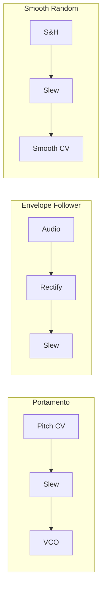

# Envelopes & Modulators

Modulation sources shape how parameters change over time, creating movement and expression.

## ADSR Envelope

The classic Attack-Decay-Sustain-Release envelope generator.

```rust,ignore
let env = patch.add("env", Adsr::new(44100.0));
```

### Inputs

| Port | Signal | Range | Description |
|------|--------|-------|-------------|
| `gate` | Gate | 0/5V | Gate on/off |
| `retrig` | Trigger | 0/5V | Retrigger (restarts attack from the current level) |
| `attack` | Unipolar CV | 0-10V | Attack time, default 0.1 |
| `decay` | Unipolar CV | 0-10V | Decay time (true segment duration), default 0.3 |
| `sustain` | Unipolar CV | 0-10V | Sustain level, default 0.7 |
| `release` | Unipolar CV | 0-10V | Release time (true segment duration), default 0.4 |
| `shape` | Gate | 0/5V | 0V = linear ramps, high = exponential one-pole |

### Outputs

| Port | Signal | Description |
|------|--------|-------------|
| `env` | Unipolar CV | Envelope output (0-10V) |
| `inv` | Unipolar CV | Inverted envelope |
| `eoc` | Trigger | End-of-cycle trigger |

`decay` and `release` are **true segment durations** — the envelope traverses its span
in the set time regardless of the sustain level. The `shape` input toggles between
linear and exponential curves.

### Envelope Stages

```
Level
  5V ┤    ╱╲
     │   ╱  ╲____
     │  ╱        ╲
     │ ╱          ╲
  0V ┼╱────────────╲────
     A    D   S    R
```

### Timing Curves

All stages use exponential curves:

**Attack:**
\\[ v(t) = 5 \cdot (1 - e^{-t/\tau_a}) \\]

**Decay/Release:**
\\[ v(t) = (v_{start} - v_{end}) \cdot e^{-t/\tau} + v_{end} \\]

### Typical Settings

| Sound | Attack | Decay | Sustain | Release |
|-------|--------|-------|---------|---------|
| Pluck | 5ms | 200ms | 0% | 100ms |
| Pad | 1s | 500ms | 80% | 2s |
| Brass | 50ms | 100ms | 70% | 200ms |
| Perc | 1ms | 50ms | 0% | 50ms |

---

## Envelope Follower

Extracts the amplitude envelope of an audio signal, with adjustable attack/release
ballistics. `type_id`: `envelope_follower`.

```rust,ignore
let follower = patch.add("follow", EnvelopeFollower::new(44100.0));
```

### Inputs

| Port | Signal | Range | Description |
|------|--------|-------|-------------|
| `in` | Audio | ±5V | Audio input |
| `attack` | Unipolar CV | 0-10V | Detector attack time, default 0.2 |
| `release` | Unipolar CV | 0-10V | Detector release time, default 0.3 |
| `gain` | Unipolar CV | 0-10V | Output gain (×4), default 0.5 |

### Outputs

| Port | Signal | Description |
|------|--------|-------------|
| `out` | Unipolar CV | Amplitude envelope (0-10V) |
| `inv` | Unipolar CV | Inverted envelope |

---

## PitchTracker

Pitch, gate and level from an audio signal: play a patch with a voice or an
instrument. Pitch is estimated with YIN. `type_id`: `pitch_tracker`.

```rust,ignore
let mic = patch.add("mic", AudioInput::new(Arc::clone(&input)));
let track = patch.add("tracker", PitchTracker::new(44100.0));
patch.connect(mic.out("out"), track.in_("in"))?;
patch.connect(track.out("voct"), vco.in_("voct"))?;
patch.connect(track.out("gate"), env.in_("gate"))?;
patch.connect(track.out("level"), vca.in_("cv"))?;
```

### Inputs

| Port | Signal | Range | Description |
|------|--------|-------|-------------|
| `in` | Audio | ±5V | Monophonic signal to track |
| `threshold` | Unipolar CV | 0-10V | Gate threshold on the `level` scale, default 0.25 |

### Outputs

| Port | Signal | Description |
|------|--------|-------------|
| `voct` | V/Oct | Pitch (0V = C4); holds the last note while the gate is low |
| `gate` | Gate | High while the input is pitched and above `threshold` |
| `level` | Unipolar CV | RMS level; a full-scale ±5V sine reads 10V |

### Parameters

| Id | Type | Values |
|----|------|--------|
| `range` | select | `0` low (40–500 Hz), `1` mid (70–1000 Hz, default), `2` high (140–2000 Hz) |

### Accuracy and timing

Measured at 48 kHz and pinned by the module's tests:

- A steady sine reads within ±1 cent anywhere in its band; with white noise
  20 dB below it, within ±10 cents. A harmonic-rich tone (a band-limited
  sawtooth) reads within ±6 cents, worst near the band's top. A tone with no
  fundamental reads right mid-band, but **near a band's top a weak or missing
  fundamental can read an octave low**: pick the band so the notes sit below
  its top.
- Plucked and struck notes open the gate as promptly as held ones and read
  within 5 cents; a very fast decay at a low pitch reads a little sharp (11–13
  cents for a 55 Hz pluck decaying in 50 ms). A swelling onset opens the gate
  at most 25 ms after an abrupt one.
- The gate opens on the first estimate whose analysis frame holds no silence
  before the onset, confirmed by the next frame, so the pitch is already right
  (±1 cent) when the gate rises. Opening takes 63.4, 48.0 and 40.8 ms (low,
  mid, high); closing after the sound ends, 28.4, 28.0 and 25.8 ms.
- After the gate falls the pitch holds within ±5 cents (±10 after a slow
  release) for notes two semitones or more above the band's floor. In a band's
  bottom two semitones a stop can leave it further off: up to ~40 cents after
  an abrupt stop (low band), ~25 after a fast release (high band).
- Noise alone never opens the gate.

The analysis is decimated and spread across ticks: about 100–300 ns per tick
(0.5–1.4% of a core at 48 kHz), constant, with no allocation in `tick` or when
the band changes.

---

## LFO (Low-Frequency Oscillator)

See [Oscillators](./oscillators.md#lfo-low-frequency-oscillator) for full documentation.

Quick reference:

```rust,ignore
let lfo = patch.add("lfo", Lfo::new(44100.0));
patch.connect(lfo.out("sin"), vcf.in_("fm"))?;
```

---

## Sample and Hold

Captures input value on trigger pulse.

```rust,ignore
let sh = patch.add("sh", SampleAndHold::new());
```

### Inputs

| Port | Signal | Description |
|------|--------|-------------|
| `in` | CV/Audio | Signal to sample |
| `trigger` | Trigger | When to sample |

### Output

| Port | Signal | Description |
|------|--------|-------------|
| `out` | CV | Held value |

### Classic Use: Random CV

```rust,ignore
// Random stepped modulation
patch.connect(noise.out("white"), sh.in_("in"))?;
patch.connect(clock.out("div_8"), sh.in_("trigger"))?;
patch.connect(sh.out("out"), vcf.in_("cutoff"))?;
```

---

## Slew Limiter

Limits rate of change—creates portamento and smoothing.

```rust,ignore
let slew = patch.add("slew", SlewLimiter::new(44100.0));
```

### Inputs

| Port | Signal | Description |
|------|--------|-------------|
| `in` | CV | Input signal |
| `rise` | Unipolar CV | Rise time (upward slew) |
| `fall` | Unipolar CV | Fall time (downward slew) |

### Output

| Port | Signal | Description |
|------|--------|-------------|
| `out` | CV | Slewed output |

### Applications


```mermaid
flowchart LR
    subgraph "Portamento"
        P1[Pitch CV] --> SLEW1[Slew] --> VCO1[VCO]
    end

    subgraph "Envelope Follower"
        P2[Audio] --> RECT[Rectify] --> SLEW2[Slew]
    end

    subgraph "Smooth Random"
        P3[S&H] --> SLEW3[Slew] --> MOD[Smooth CV]
    end
```

---

## Quantizer

Snaps a V/Oct input to the nearest degree of a fixed scale. The scale is chosen at
construction (not a port). `type_id`: `quantizer`.

```rust,ignore
let quant = patch.add("quant", Quantizer::major());
// Also: Quantizer::new(Scale::Dorian), Quantizer::chromatic(), Quantizer::minor()
```

### Input

| Port | Signal | Description |
|------|--------|-------------|
| `in` | V/Oct | Unquantized pitch |

### Output

| Port | Signal | Description |
|------|--------|-------------|
| `out` | V/Oct | Quantized pitch |

### Available Scales

`Scale`: `Chromatic`, `Major`, `Minor`, `PentatonicMajor`, `PentatonicMinor`, `Dorian`,
`Mixolydian`, `Blues`. Change at runtime with `quantizer.set_scale(Scale::Minor)`.

---

## Scale Quantizer

A quantizer with CV-selectable root and scale, boundary hysteresis, a note-change
trigger, and optional microtuning. `type_id`: `scale_quantizer`.

```rust,ignore
let sq = patch.add("sq", ScaleQuantizer::new(44100.0));
```

### Inputs

| Port | Signal | Range | Description |
|------|--------|-------|-------------|
| `in` | V/Oct | ±5V | Pitch to quantize |
| `root` | Unipolar CV | 0-10V | Root note (0–11 semitones) |
| `scale` | Unipolar CV | 0-10V | Scale select (7 built-in scales) |

### Outputs

| Port | Signal | Description |
|------|--------|-------------|
| `out` | V/Oct | Quantized pitch |
| `trigger` | Trigger | Fires on a committed note change |

### Microtuning (with the `alloc` feature)

```rust,ignore
// Install a custom scale from cents offsets within an octave:
sq_module.set_custom_scale(&[0.0, 200.0, 350.0, 700.0, 900.0]);

// Or load a Scala .scl file body:
sq_module.load_scala(scl_source)?;
```

---

## Clock

Master timing generator.

```rust,ignore
let clock = patch.add("clock", Clock::new(44100.0));
```

### Inputs

| Port | Signal | Description |
|------|--------|-------------|
| `tempo` | Unipolar CV | BPM (0-10V = 20-300 BPM) |
| `reset` | Trigger | Reset to beat 1 |

### Outputs

| Port | Signal | Description |
|------|--------|-------------|
| `div_1` | Trigger | Whole notes |
| `div_2` | Trigger | Half notes |
| `div_4` | Trigger | Quarter notes |
| `div_8` | Trigger | Eighth notes |
| `div_16` | Trigger | Sixteenth notes |
| `div_32` | Trigger | 32nd notes |

---

## Step Sequencer

8-step CV/gate sequencer.

```rust,ignore
let seq = patch.add("seq", StepSequencer::new());
```

### Inputs

| Port | Signal | Description |
|------|--------|-------------|
| `clock` | Trigger | Advance to next step |
| `reset` | Trigger | Return to step 1 |

### Outputs

| Port | Signal | Description |
|------|--------|-------------|
| `cv` | V/Oct | Step CV value |
| `gate` | Gate | Step gate state |

### Programming Steps

The sequencer holds 8 CV/gate pairs. In a full application, you'd set these via UI or MIDI.
