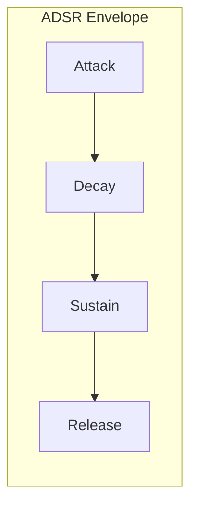
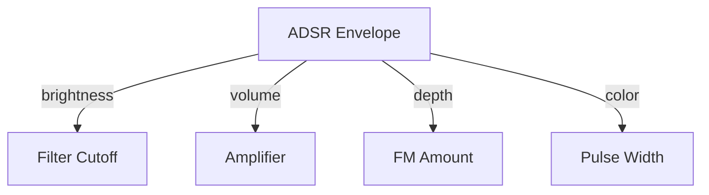
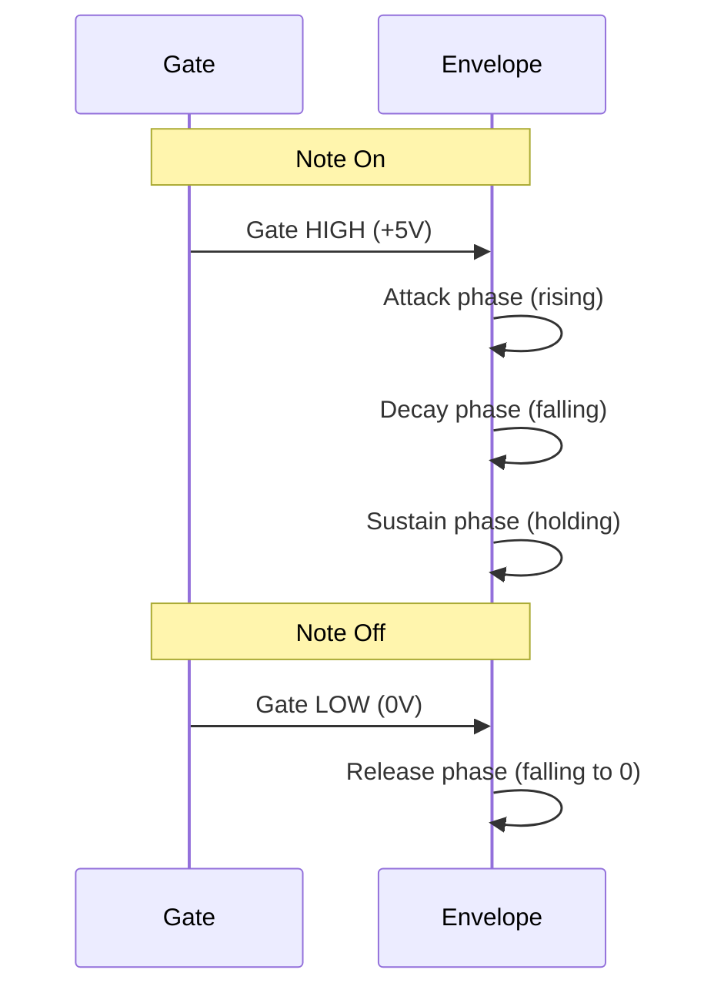

# Envelope Shaping

An envelope generator shapes how a parameter changes over time. The classic ADSR (Attack, Decay, Sustain, Release) envelope is the heartbeat of synthesis.



## Anatomy of ADSR

```
    │     ╱╲
    │    ╱  ╲_______
    │   ╱           ╲
    │  ╱             ╲
    │ ╱               ╲
────┴───────────────────────
    A   D    S     R
    ↑   ↑    ↑     ↑
   Gate On        Gate Off
```

| Stage | Description | Typical Range |
|-------|-------------|---------------|
| **Attack** | Time to reach peak (0→5V) | 1ms - 10s |
| **Decay** | Time to fall to sustain level | 1ms - 10s |
| **Sustain** | Level held while gate is high | 0V - 5V |
| **Release** | Time to return to zero | 1ms - 10s |

## The Mathematics

Each stage is typically an exponential curve:

**Attack (exponential rise):**
$$v(t) = V_{max} \cdot (1 - e^{-t/\tau_a})$$

**Decay/Release (exponential fall):**
$$v(t) = V_{start} \cdot e^{-t/\tau_d}$$

Where $\tau$ is the time constant. Analog envelopes have this natural exponential shape—it's how capacitors charge and discharge.

## Building the Example

```rust,ignore
{{#include ../../../examples/tutorial_envelope.rs}}
```

## Envelope as Modulation Source

The envelope doesn't just control volume. Route it to:



### Filter Envelope

Routing envelope to filter creates the classic "brightness sweep":

- **Plucky bass**: Fast attack, fast decay, low sustain
- **Brass stab**: Medium attack, fast decay, medium sustain
- **String pad**: Slow attack, slow decay, high sustain

### Dual Envelope Routing

Different amounts to different destinations:

| Destination | Amount | Effect |
|-------------|--------|--------|
| VCA | 100% | Full volume control |
| VCF | 50% | Subtle brightness sweep |
| Pitch | 5% | Pitch "blip" on attack |

## Musical Applications

### Plucky Synth Bass

```
Attack:  5ms   (instant)
Decay:   200ms (quick fall)
Sustain: 30%   (some body)
Release: 100ms (clean cutoff)
```

### Swelling Pad

```
Attack:  2s    (slow fade in)
Decay:   500ms (gentle settle)
Sustain: 80%   (full and rich)
Release: 3s    (long tail)
```

### Percussive Hit

```
Attack:  1ms   (instant)
Decay:   50ms  (very fast)
Sustain: 0%    (no sustain)
Release: 50ms  (immediate)
```

## Envelope Stages Visualization



---

Next: [Filter Modulation](./filter-modulation.md)
