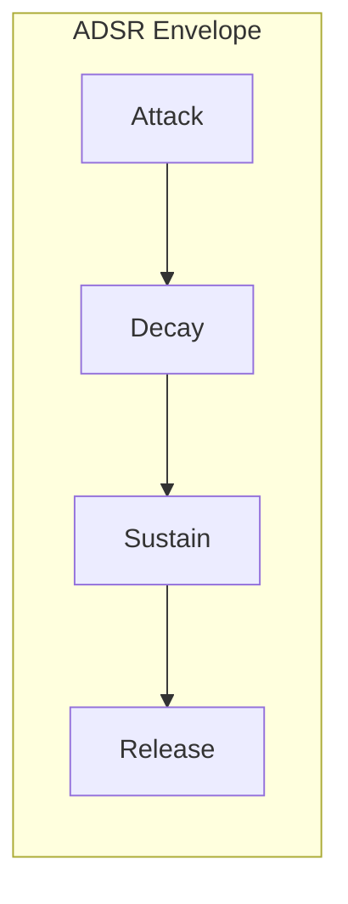
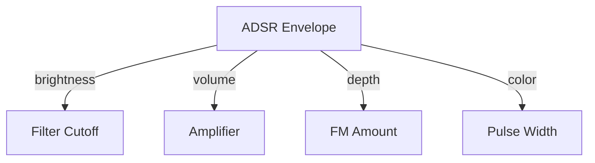
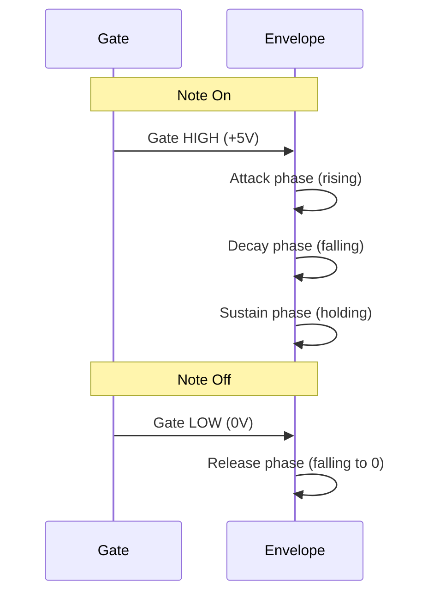

# Envelope Shaping

An envelope generator shapes how a parameter changes over time. The classic ADSR (Attack, Decay, Sustain, Release) envelope is the heartbeat of synthesis.


```mermaid
graph LR
    subgraph "ADSR Envelope"
        A[Attack] --> D[Decay]
        D --> S[Sustain]
        S --> R[Release]
    end
```

## Anatomy of ADSR

```
    │     ╱╲
    │    ╱  ╲_______
    │   ╱           ╲
    │  ╱             ╲
    │ ╱               ╲
────┴───────────────────────
    A   D    S     R
    ↑   ↑    ↑     ↑
   Gate On        Gate Off
```

| Stage | Description | Typical Range |
|-------|-------------|---------------|
| **Attack** | Time to reach peak (0→5V) | 1ms - 10s |
| **Decay** | Time to fall to sustain level | 1ms - 10s |
| **Sustain** | Level held while gate is high | 0V - 5V |
| **Release** | Time to return to zero | 1ms - 10s |

## The Mathematics

Each stage is typically an exponential curve:

**Attack (exponential rise):**
\\[ v(t) = V_{max} \cdot (1 - e^{-t/\tau_a}) \\]

**Decay/Release (exponential fall):**
\\[ v(t) = V_{start} \cdot e^{-t/\tau_d} \\]

Where \\( \tau \\) is the time constant. Analog envelopes have this natural exponential shape—it's how capacitors charge and discharge.

## Building the Example

In this patch the four ADSR stages are not knob settings — they are CV inputs, each fed by an `Offset` module. The envelope shapes only the VCA, so what you hear is the pure volume contour:

<div class="quiver-explorable" data-viz="patchgraph">
<script type="application/json">
{
  "modules": [
    {"id": "vco", "label": "VCO", "x": 0, "y": 0,
     "outputs": [{"name": "saw", "kind": "audio"}]},
    {"id": "gate", "label": "GATE", "x": 0, "y": 2.2,
     "outputs": [{"name": "out", "kind": "gate"}]},
    {"id": "attack_cv", "label": "ATTACK CV", "x": 0, "y": 4.4,
     "outputs": [{"name": "out", "kind": "cv"}]},
    {"id": "decay_cv", "label": "DECAY CV", "x": 0, "y": 6.2,
     "outputs": [{"name": "out", "kind": "cv"}]},
    {"id": "sustain_cv", "label": "SUSTAIN CV", "x": 0, "y": 8.0,
     "outputs": [{"name": "out", "kind": "cv"}]},
    {"id": "release_cv", "label": "RELEASE CV", "x": 0, "y": 9.8,
     "outputs": [{"name": "out", "kind": "cv"}]},
    {"id": "env", "label": "ADSR", "x": 1, "y": 2.2,
     "inputs": [{"name": "gate", "kind": "gate"}, {"name": "attack", "kind": "cv"}, {"name": "decay", "kind": "cv"}, {"name": "sustain", "kind": "cv"}, {"name": "release", "kind": "cv"}],
     "outputs": [{"name": "env", "kind": "cv"}]},
    {"id": "vca", "label": "VCA", "x": 2, "y": 0,
     "inputs": [{"name": "in", "kind": "audio"}, {"name": "cv", "kind": "cv"}],
     "outputs": [{"name": "out", "kind": "audio"}]},
    {"id": "output", "label": "OUTPUT", "x": 3, "y": 0,
     "inputs": [{"name": "left", "kind": "audio"}]}
  ],
  "cables": [
    {"from": "gate.out", "to": "env.gate", "kind": "gate"},
    {"from": "attack_cv.out", "to": "env.attack", "kind": "cv"},
    {"from": "decay_cv.out", "to": "env.decay", "kind": "cv"},
    {"from": "sustain_cv.out", "to": "env.sustain", "kind": "cv"},
    {"from": "release_cv.out", "to": "env.release", "kind": "cv"},
    {"from": "vco.saw", "to": "vca.in", "kind": "audio"},
    {"from": "env.env", "to": "vca.cv", "kind": "cv"},
    {"from": "vca.out", "to": "output.left", "kind": "audio"}
  ],
  "caption": "tutorial_envelope: four Offset modules dial in the ADSR stages as CV; the envelope shapes the VCA alone."
}
</script>
</div>

*Drag the four stages yourself and watch the contour respond in [Envelopes Shape Time](../explorables/envelopes.md).*

```rust,ignore
{{#include ../../../examples/tutorial_envelope.rs}}
```

Run it with `cargo run --example tutorial_envelope`.

## Envelope as Modulation Source

The envelope doesn't just control volume. Route it to:


```mermaid
flowchart TD
    ADSR[ADSR Envelope]
    ADSR -->|brightness| VCF[Filter Cutoff]
    ADSR -->|volume| VCA[Amplifier]
    ADSR -->|depth| FM[FM Amount]
    ADSR -->|color| PWM[Pulse Width]
```

### Filter Envelope

Routing envelope to filter creates the classic "brightness sweep":

- **Plucky bass**: Fast attack, fast decay, low sustain
- **Brass stab**: Medium attack, fast decay, medium sustain
- **String pad**: Slow attack, slow decay, high sustain

### Dual Envelope Routing

Different amounts to different destinations:

| Destination | Amount | Effect |
|-------------|--------|--------|
| VCA | 100% | Full volume control |
| VCF | 50% | Subtle brightness sweep |
| Pitch | 5% | Pitch "blip" on attack |

## Musical Applications

### Plucky Synth Bass

```
Attack:  5ms   (instant)
Decay:   200ms (quick fall)
Sustain: 30%   (some body)
Release: 100ms (clean cutoff)
```

### Swelling Pad

```
Attack:  2s    (slow fade in)
Decay:   500ms (gentle settle)
Sustain: 80%   (full and rich)
Release: 3s    (long tail)
```

### Percussive Hit

```
Attack:  1ms   (instant)
Decay:   50ms  (very fast)
Sustain: 0%    (no sustain)
Release: 50ms  (immediate)
```

## Envelope Stages Visualization


```mermaid
sequenceDiagram
    participant G as Gate
    participant E as Envelope

    Note over G,E: Note On
    G->>E: Gate HIGH (+5V)
    E->>E: Attack phase (rising)
    E->>E: Decay phase (falling)
    E->>E: Sustain phase (holding)

    Note over G,E: Note Off
    G->>E: Gate LOW (0V)
    E->>E: Release phase (falling to 0)
```

---

Next: [Filter Modulation](./filter-modulation.md)
