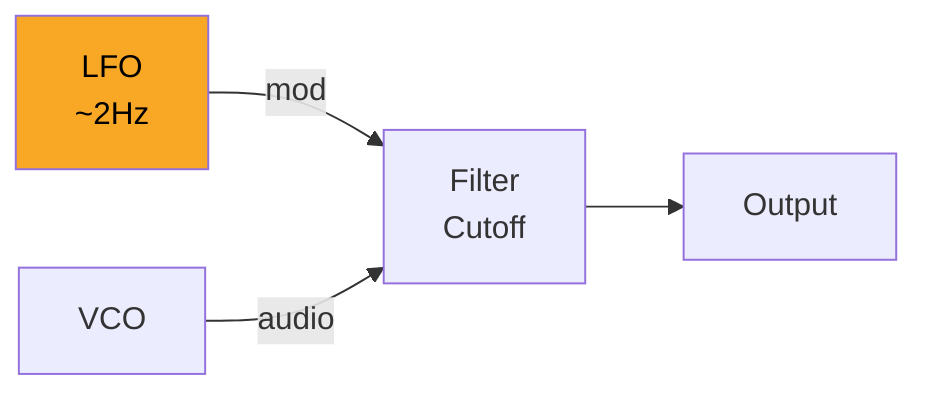
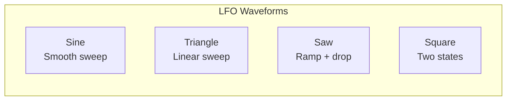
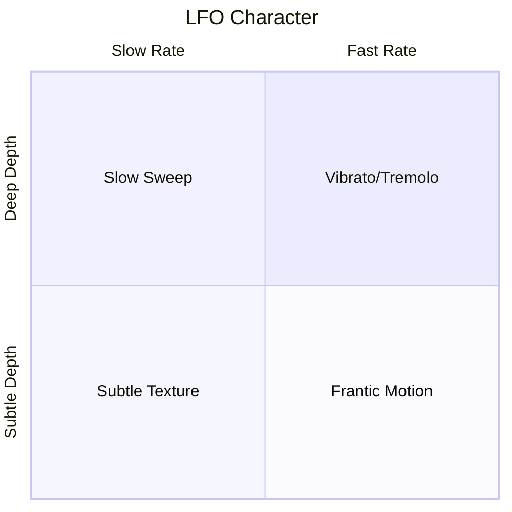
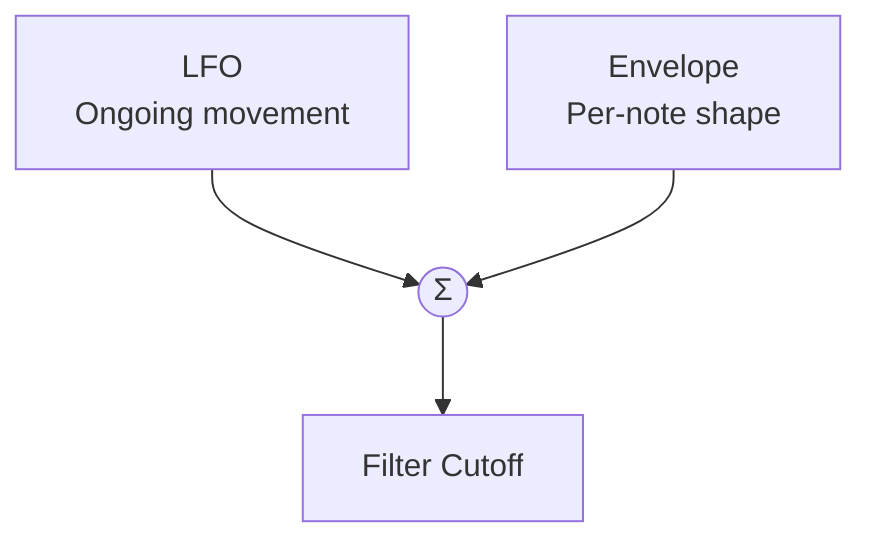

# Filter Modulation

Modulation brings patches to life. When we connect an LFO (Low Frequency Oscillator) to the filter cutoff, static becomes dynamic—a still photograph becomes a movie.



## LFO: The Modulation Source

An LFO is simply an oscillator running at sub-audio rates:

| Audio Oscillator | LFO |
|------------------|-----|
| 20Hz - 20kHz | 0.01Hz - 30Hz |
| Creates pitch | Creates movement |
| You hear it | You feel its effect |



## The Mathematics of Modulation

Filter cutoff with LFO modulation:

$$f_c(t) = f_{center} + f_{depth} \cdot \text{LFO}(t)$$

Where:
- $f_{center}$ is the base cutoff frequency
- $f_{depth}$ is the modulation depth (how far it sweeps)
- $\text{LFO}(t)$ oscillates between -1 and +1

## Building the Patch

```rust,ignore
{{#include ../../../examples/tutorial_filter_mod.rs}}
```

## Modulation Depth and Attenuverters

The amount of modulation matters:

| Depth | Effect |
|-------|--------|
| 10% | Subtle shimmer |
| 25% | Noticeable movement |
| 50% | Dramatic sweep |
| 100% | Extreme wah-wah |

Quiver cables support attenuation:

```rust,ignore
// Connect with 50% modulation depth
patch.connect_with(
    lfo.out("sin"),
    vcf.in_("cutoff"),
    Cable::new().with_attenuation(0.5),
)?;
```

## Waveform Shapes

Each LFO waveform creates a different movement:

### Sine Wave
Smooth, natural sweeping—good for gentle effects.

```
    ╱╲    ╱╲    ╱╲
   ╱  ╲  ╱  ╲  ╱  ╲
──╱────╲╱────╲╱────╲──
```

### Triangle Wave
Linear sweeping—predictable, good for trills.

```
   ╱╲    ╱╲    ╱╲
  ╱  ╲  ╱  ╲  ╱  ╲
─╱────╲╱────╲╱────╲─
```

### Sawtooth Wave
Rises slowly, drops instantly—creates rhythmic "pumping."

```
   ╱│   ╱│   ╱│
  ╱ │  ╱ │  ╱ │
─╱──│─╱──│─╱──│──
```

### Square Wave
Instant alternation between two states—tremolo/vibrato effect.

```
 ┌──┐  ┌──┐  ┌──┐
 │  │  │  │  │  │
─┘  └──┘  └──┘  └─
```

## Rate and Depth Interaction



| Rate | Depth | Classic Use |
|------|-------|-------------|
| 0.5Hz | 30% | Slow filter sweep |
| 2Hz | 10% | Subtle shimmer |
| 6Hz | 50% | Dubstep wobble |
| 8Hz | 5% | Guitar vibrato |

## Multiple Modulation Sources

Combine LFO with envelope for evolving sounds:



The envelope provides the initial "brightness burst," while the LFO adds continuous movement during sustain.

---

Next: [Building a Sequenced Bass](./sequenced-bass.md)
