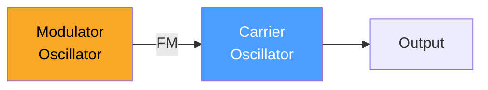
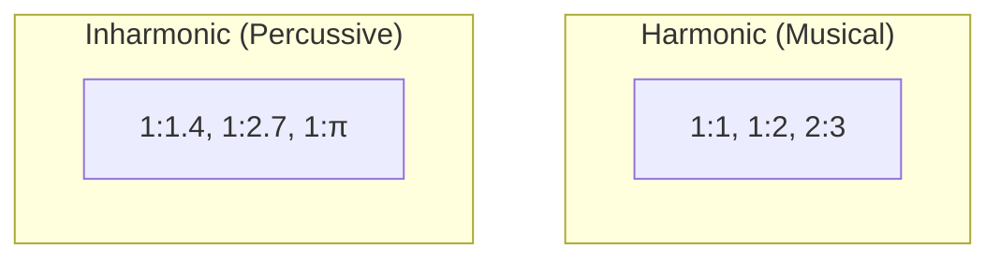
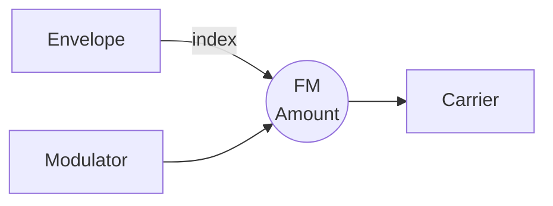
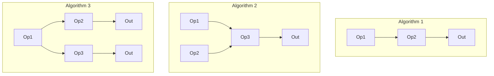

# FM Synthesis Basics

Frequency Modulation (FM) synthesis creates complex timbres by modulating one oscillator's frequency with another. It's the technology behind the DX7 and countless digital synths.



## The Mathematics

In FM synthesis, the carrier frequency is modulated by the modulator:

$$y(t) = A \sin(2\pi f_c t + I \sin(2\pi f_m t))$$

Where:
- $f_c$ = carrier frequency (the pitch you hear)
- $f_m$ = modulator frequency
- $I$ = modulation index (depth)
- $A$ = amplitude

The **modulation index** controls harmonic richness:

| Index | Sound Character |
|-------|-----------------|
| 0 | Pure sine (no modulation) |
| 1-2 | Warm, mellow |
| 3-5 | Bright, electric piano-like |
| 6+ | Harsh, metallic |

## The Carrier:Modulator Ratio

The frequency ratio determines the harmonic structure:

| C:M Ratio | Result |
|-----------|--------|
| 1:1 | Symmetric harmonics |
| 1:2 | Octave-related harmonics |
| 2:1 | Subharmonics present |
| 1:1.414 | Inharmonic (bell-like) |
| 1:3.5 | Metallic, clangorous |



## Building FM in Quiver

```rust,ignore
{{#include ../../../examples/tutorial_fm.rs}}
```

## Sideband Theory

FM creates **sidebands** around the carrier frequency:

$$f_{sidebands} = f_c \pm n \cdot f_m$$

Where $n = 1, 2, 3, ...$

```
       ▲
       │    ▲
   ▲   │    │   ▲
   │   │    │   │
───┴───┴────┴───┴───
  -2fm -fm  fc  +fm +2fm
```

The modulation index determines how many sidebands have significant amplitude (roughly $I + 1$ sidebands on each side).

## Envelope the Index

The key to expressive FM is **modulating the modulation index** over time:



A decaying envelope creates the characteristic "bright attack, mellow sustain" of electric pianos.

## Classic FM Sounds

### Electric Piano (DX7 Style)

```
Carrier:Modulator = 1:1
Index envelope: Fast attack, medium decay
Starting index: ~5
Ending index: ~1
```

### Brass

```
Carrier:Modulator = 1:1
Index envelope: Slow attack
Starting index: 2
Peak index: 8
```

### Bell

```
Carrier:Modulator = 1:1.414 (√2)
Index: 8-10 (constant)
Long release envelope
```

### Bass

```
Carrier:Modulator = 1:2
Fast index decay
Heavy carrier filtering
```

## FM vs Subtractive

| Aspect | Subtractive | FM |
|--------|-------------|-----|
| Harmonics | Remove from rich source | Generate from sine waves |
| CPU | Filter computation | Multiple oscillators |
| Character | Warm, analog | Bright, digital |
| Control | Intuitive | Parameter-sensitive |

## Stacking Operators

Classic FM synths use 4-6 "operators" (oscillators) in various configurations:



Each algorithm creates different timbral possibilities.

---

Next: [Polyphonic Patches](./polyphony.md)
