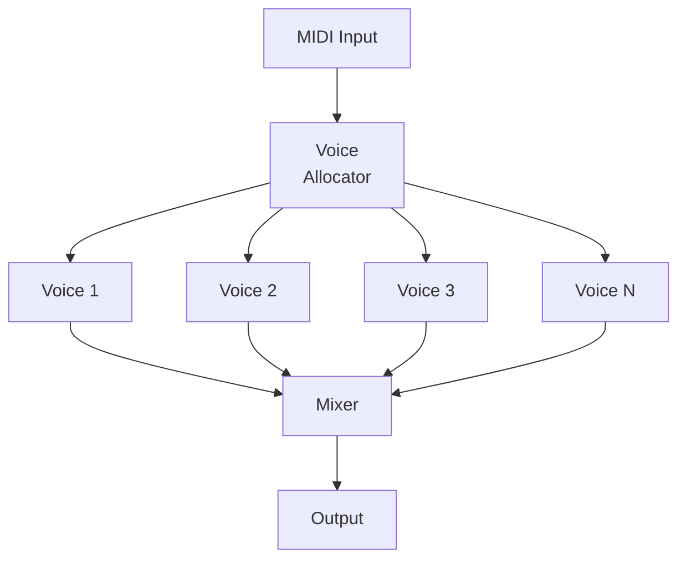
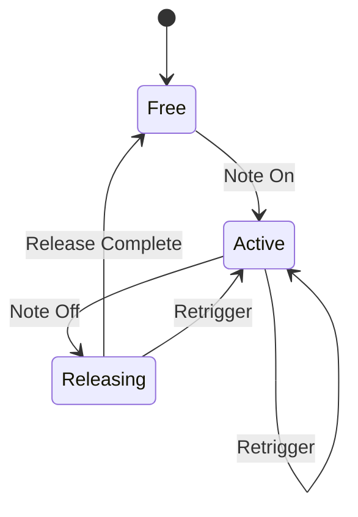
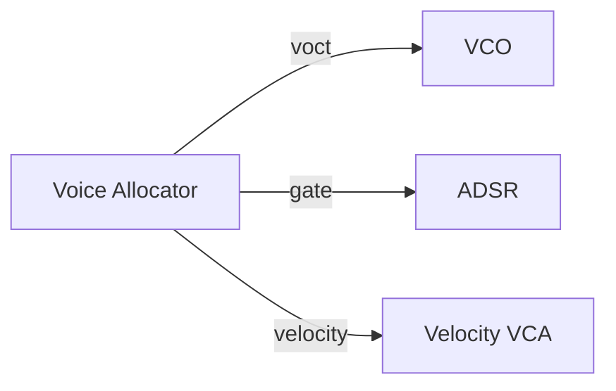
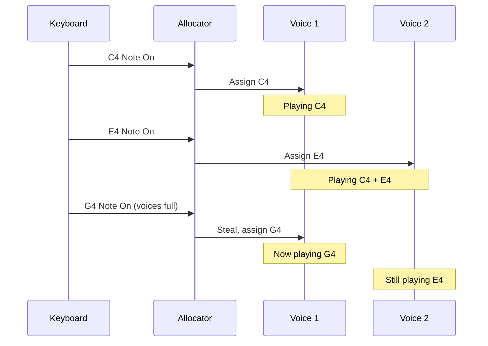
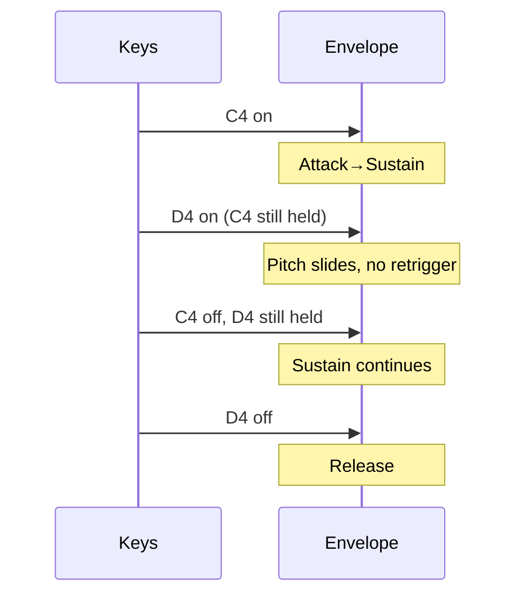

# Polyphonic Patches

So far we've built monophonic (single-voice) patches. Real keyboards need **polyphony**—multiple simultaneous notes. Quiver provides a complete voice allocation system.



## Voice Allocation

When a new note arrives and all voices are busy, which voice should be "stolen"?

| Strategy | Description | Best For |
|----------|-------------|----------|
| **RoundRobin** | Steal oldest voice | Even wear |
| **QuietestSteal** | Steal softest voice | Minimal artifacts |
| **OldestSteal** | Steal note held longest | Predictable |
| **NoSteal** | Ignore new notes | Pad sounds |
| **HighestPriority** | High notes steal low | Melodies |
| **LowestPriority** | Low notes steal high | Bass lines |

## Voice States

Each voice has a lifecycle:



## Building a Polyphonic Patch

```rust,ignore
{{#include ../../../examples/tutorial_polyphony.rs}}
```

## Per-Voice Signals

Each voice receives its own:
- **V/Oct pitch** — from the played note
- **Gate** — high while key held
- **Trigger** — pulse at note start
- **Velocity** — key strike strength



## Unison and Detune

For thicker sounds, stack multiple oscillators per voice:

```rust,ignore
let config = UnisonConfig::new(3)  // 3 oscillators per voice
    .with_detune(0.1)              // Slight detune between them
    .with_spread(0.5);             // Stereo spread
```

The slight detuning creates a chorus-like richness.

## MIDI Note to V/Oct

Quiver uses the standard conversion:

$$V_{oct} = \frac{\text{MIDI} - 60}{12}$$

| MIDI Note | Name | V/Oct |
|-----------|------|-------|
| 48 | C3 | -1.0V |
| 60 | C4 | 0.0V |
| 72 | C5 | +1.0V |
| 84 | C6 | +2.0V |

Helper function:
```rust,ignore
fn midi_note_to_voct(note: u8) -> f64 {
    (note as f64 - 60.0) / 12.0
}
```

## Voice Stealing in Action



## Legato Mode

For lead sounds, you might want **legato**: new notes don't retrigger the envelope if a previous note is held.



## Performance Considerations

Polyphony multiplies CPU usage:
- 8 voices × 4 oscillators = 32 oscillators
- Each voice has its own filter, envelope, etc.

Quiver's block processing helps:
```rust,ignore
// Process multiple samples at once
let mut block = AudioBlock::new();
for voice in voices.iter_mut() {
    voice.process_block(&mut block);
}
```

---

That concludes the Tutorials section. Next, explore [How-To Guides](../how-to/connect-modules.md) for task-focused recipes.
