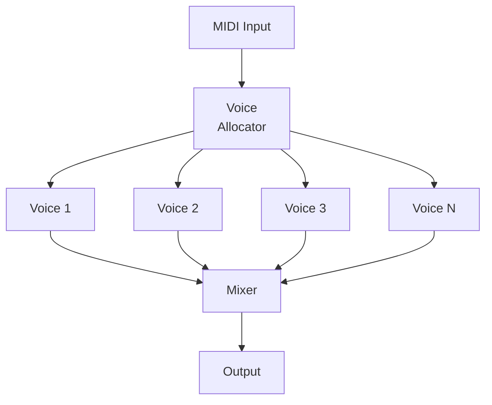
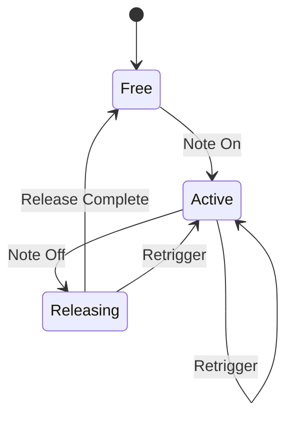
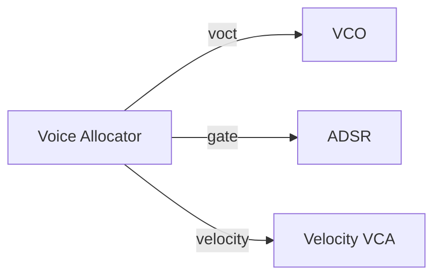
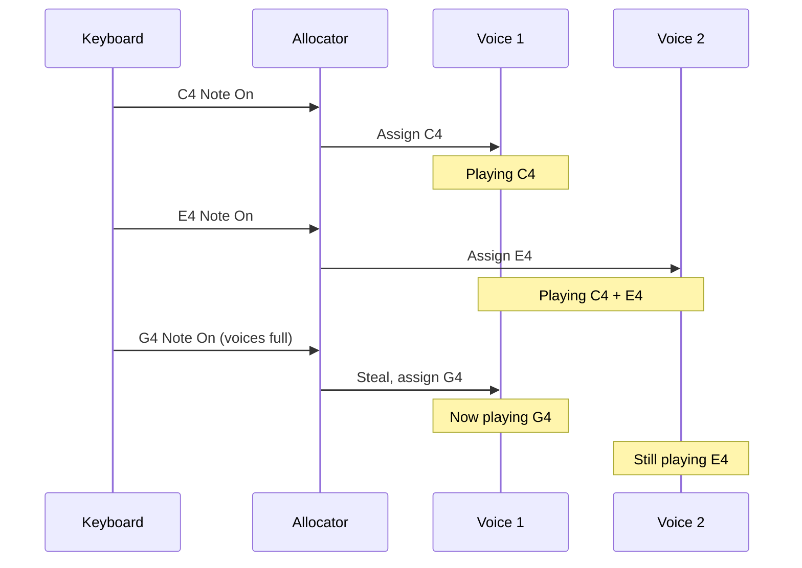
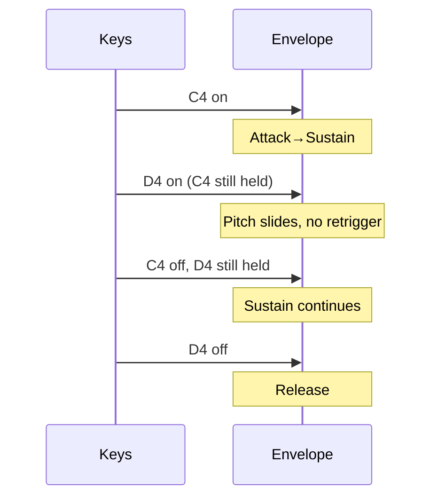

# Polyphonic Patches

So far we've built monophonic (single-voice) patches. Real keyboards need **polyphony**—multiple simultaneous notes. Quiver provides a complete voice allocation system.


```mermaid
flowchart TB
    MIDI[MIDI Input] --> VA[Voice<br/>Allocator]
    VA --> V1[Voice 1]
    VA --> V2[Voice 2]
    VA --> V3[Voice 3]
    VA --> VN[Voice N]
    V1 --> MIX[Mixer]
    V2 --> MIX
    V3 --> MIX
    VN --> MIX
    MIX --> OUT[Output]
```

## Voice Allocation

When a new note arrives and all voices are busy, which voice should be "stolen"?

| Strategy | Description | Best For |
|----------|-------------|----------|
| **RoundRobin** | Steal oldest voice | Even wear |
| **QuietestSteal** | Steal softest voice | Minimal artifacts |
| **OldestSteal** | Steal note held longest | Predictable |
| **NoSteal** | Ignore new notes | Pad sounds |
| **HighestPriority** | High notes steal low | Melodies |
| **LowestPriority** | Low notes steal high | Bass lines |

## Voice States

Each voice has a lifecycle:


```mermaid
stateDiagram-v2
    [*] --> Free
    Free --> Active: Note On
    Active --> Releasing: Note Off
    Releasing --> Free: Release Complete
    Active --> Active: Retrigger
    Releasing --> Active: Retrigger
```

## Building a Polyphonic Patch

```rust,ignore
{{#include ../../../examples/tutorial_polyphony.rs}}
```

## The `PolyPatch` API

`PolyPatch::with_voice_fn(voices, sample_rate, build)` builds one voice graph per voice by
calling your closure. The closure receives a fresh `Patch` and a **voice controller**
(`ctrl`) whose outputs — `voct`, `gate`, `trigger`, and `velocity` — carry the allocator's
per-voice control values into the graph:

```rust,ignore
use quiver::prelude::*;

let sr = 48_000.0;
let mut poly = PolyPatch::with_voice_fn(4, sr, |patch, ctrl| {
    let sr = patch.sample_rate();
    let vco = patch.add("vco", Vco::new(sr));
    let adsr = patch.add("adsr", Adsr::new(sr));
    let vca = patch.add("vca", Vca::new());
    let out = patch.add("out", StereoOutput::new());

    // The controller exposes voct / gate / trigger / velocity.
    patch.connect(ctrl.out("voct"), vco.in_("voct"))?;
    patch.connect(ctrl.out("gate"), adsr.in_("gate"))?;
    patch.connect(vco.out("saw"), vca.in_("in"))?;
    patch.connect(adsr.out("env"), vca.in_("cv"))?;
    patch.connect(vca.out("out"), out.in_("left"))?;
    patch.set_output(out.id());
    Ok(())
})
.unwrap();

poly.note_on(60, 100); // MIDI note, velocity (0-127)
let (_l, _r) = poly.tick();
poly.note_off(60);
```

What `PolyPatch` handles for you:

- **Automatic voice freeing**: each voice's real output level is tracked by an amplitude
  follower, so a voice returns to `Free` only once its release tail has actually decayed —
  not the instant the gate falls.
- **Releasing-first voice stealing**: when all voices are busy, voices already in
  `Releasing` are stolen before sounding ones (see the [allocation modes](#voice-allocation)
  for how a sounding victim is then chosen).
- **`1/sqrt(N)` level compensation**: the mix is scaled by an equal-power factor that is
  *smoothed*, so stacking or releasing voices never steps the master level.

## Per-Voice Signals

Each voice receives its own:
- **V/Oct pitch** — from the played note
- **Gate** — high while key held
- **Trigger** — pulse at note start
- **Velocity** — key strike strength


```mermaid
flowchart LR
    VA[Voice Allocator]
    VA -->|voct| VCO[VCO]
    VA -->|gate| ENV[ADSR]
    VA -->|velocity| VCA[Velocity VCA]
```

## Unison and Detune

For thicker sounds, stack multiple detuned voices with `UnisonConfig`:

```rust,ignore
// 3 voices per note, spread 12 cents apart.
let config = UnisonConfig::new(3, 12.0);
poly.set_unison(config);
```

The slight detuning creates a chorus-like richness. `detune_offset(i)` and
`pan_position(i)` give the per-voice pitch offset and stereo pan.

## MIDI Note to V/Oct

Quiver uses the standard conversion:

\\[ V_{oct} = \frac{\text{MIDI} - 60}{12} \\]

| MIDI Note | Name | V/Oct |
|-----------|------|-------|
| 48 | C3 | -1.0V |
| 60 | C4 | 0.0V |
| 72 | C5 | +1.0V |
| 84 | C6 | +2.0V |

Helper function:
```rust,ignore
fn midi_note_to_voct(note: u8) -> f64 {
    (note as f64 - 60.0) / 12.0
}
```

## Voice Stealing in Action


```mermaid
sequenceDiagram
    participant K as Keyboard
    participant VA as Allocator
    participant V1 as Voice 1
    participant V2 as Voice 2

    K->>VA: C4 Note On
    VA->>V1: Assign C4
    Note over V1: Playing C4

    K->>VA: E4 Note On
    VA->>V2: Assign E4
    Note over V1,V2: Playing C4 + E4

    K->>VA: G4 Note On (voices full)
    VA->>V1: Steal, assign G4
    Note over V1: Now playing G4
    Note over V2: Still playing E4
```

## Legato Mode

For lead sounds, you might want **legato**: new notes don't retrigger the envelope if a previous note is held.


```mermaid
sequenceDiagram
    participant K as Keys
    participant E as Envelope

    K->>E: C4 on
    Note over E: Attack→Sustain

    K->>E: D4 on (C4 still held)
    Note over E: Pitch slides, no retrigger

    K->>E: C4 off, D4 still held
    Note over E: Sustain continues

    K->>E: D4 off
    Note over E: Release
```

## Performance Considerations

Polyphony multiplies CPU usage:
- 8 voices × 4 oscillators = 32 oscillators
- Each voice has its own filter, envelope, etc.

Quiver's block processing helps:
```rust,ignore
// Process multiple samples at once
let mut block = AudioBlock::new();
for voice in voices.iter_mut() {
    voice.process_block(&mut block);
}
```

---

That concludes the Tutorials section. Next, explore [How-To Guides](../how-to/connect-modules.md) for task-focused recipes.
