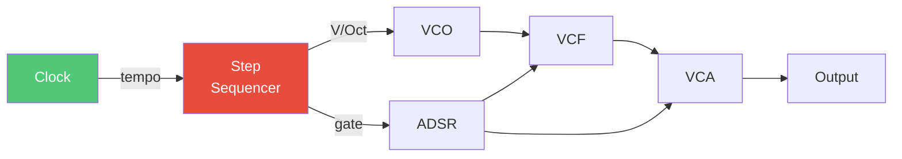
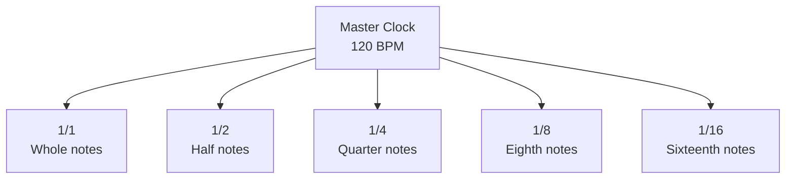
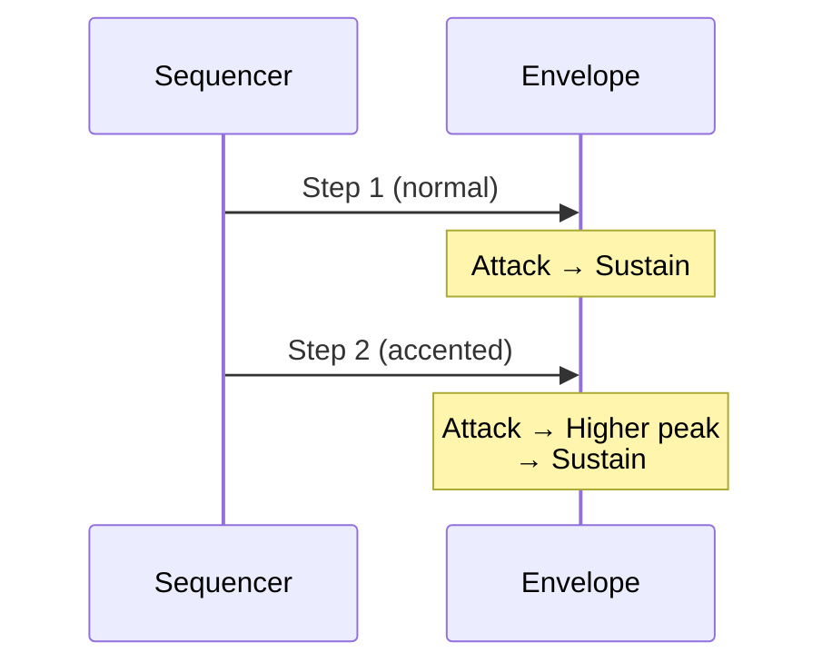

# Building a Sequenced Bass

Let's create something musical: a step sequencer driving a bass synthesizer. This is the foundation of countless electronic music tracks.



## The Step Sequencer

A step sequencer cycles through a series of values, advancing on each clock pulse:

```
Step:    1    2    3    4    5    6    7    8
CV:     ┌─┐  ┌─┐       ┌─┐  ┌─┐       ┌─┐  ┌─┐
        │ │  │ │       │ │  │ │       │ │  │ │
Gate:   └─┘  └─┘       └─┘  └─┘       └─┘  └─┘
        C3   D3  rest  G3   C3  rest  E3   D3
```

Each step can have:
- **CV value**: The pitch (in V/Oct)
- **Gate**: On or off (rest = off)

## V/Oct and Musical Pitches

Converting notes to voltages:

| Note | MIDI | V/Oct |
|------|------|-------|
| C3 | 48 | -1.0V |
| C4 | 60 | 0.0V |
| D4 | 62 | +0.167V |
| E4 | 64 | +0.333V |
| G4 | 67 | +0.583V |
| C5 | 72 | +1.0V |

The formula:

$$V = \frac{\text{MIDI} - 60}{12}$$

## Building the Patch

```rust,ignore
{{#include ../../../examples/tutorial_sequenced_bass.rs}}
```

## Clock Divisions

The clock module provides multiple time divisions:



For a bassline at 120 BPM:
- 1/8 notes = 4 Hz (classic house tempo)
- 1/16 notes = 8 Hz (driving techno)

## Filter Envelope Relationship

The key to punchy bass is the filter envelope:

```
Attack:  Fast (5ms)
Decay:   Medium (100-200ms)
Sustain: Low (20-40%)
Release: Quick (50-100ms)
```

This creates the characteristic "pluck" where brightness fades quickly.

## Accent and Dynamics

Real sequences have accents—emphasized notes. Implement with velocity:



## Classic Patterns

### House Bass
```
Step: 1  2  3  4  5  6  7  8
Note: C  -  C  -  C  -  C  C
```
The off-beat creates the groove.

### Acid (TB-303 Style)
```
Step: 1  2  3  4  5  6  7  8
Note: C  C  D  -  F  -  D  C
Acc:  X           X
Slide:   →     →
```
Accents and slides define the style.

### Minimal Techno
```
Step: 1  2  3  4  5  6  7  8
Note: C  -  -  -  C  -  -  -
```
Space and repetition create hypnotic effect.

## Going Further

- Add **slide/portamento** with `SlewLimiter`
- Randomize steps with `BernoulliGate`
- Quantize to scale with `Quantizer`
- Layer with detuned second VCO

---

Next: [FM Synthesis Basics](./fm-synthesis.md)
