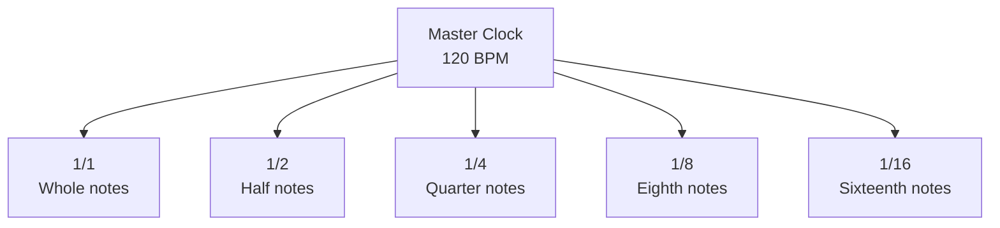
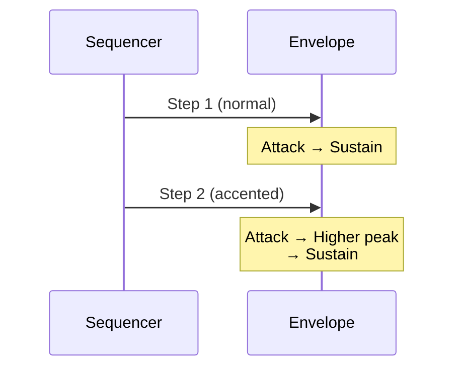

# Building a Sequenced Bass

Let's create something musical: a step sequencer driving a bass synthesizer. This is the foundation of countless electronic music tracks.

<div class="quiver-explorable" data-viz="patchgraph">
<script type="application/json">
{
  "modules": [
    {"id": "clock", "label": "CLOCK", "x": 0, "y": 3.4,
     "outputs": [{"name": "out", "kind": "clock"}]},
    {"id": "seq", "label": "STEP SEQ", "x": 1, "y": 3.4,
     "inputs": [{"name": "clock", "kind": "clock"}],
     "outputs": [{"name": "cv", "kind": "voct"}, {"name": "gate", "kind": "gate"}]},
    {"id": "vco", "label": "VCO", "x": 2, "y": 0,
     "inputs": [{"name": "voct", "kind": "voct"}],
     "outputs": [{"name": "saw", "kind": "audio"}]},
    {"id": "env", "label": "ADSR", "x": 2, "y": 3.4,
     "inputs": [{"name": "gate", "kind": "gate"}],
     "outputs": [{"name": "env", "kind": "cv"}]},
    {"id": "vcf", "label": "VCF (SVF)", "x": 3, "y": 0,
     "inputs": [{"name": "in", "kind": "audio"}, {"name": "cutoff", "kind": "cv"}],
     "outputs": [{"name": "lp", "kind": "audio"}]},
    {"id": "vca", "label": "VCA", "x": 4, "y": 0,
     "inputs": [{"name": "in", "kind": "audio"}, {"name": "cv", "kind": "cv"}],
     "outputs": [{"name": "out", "kind": "audio"}]},
    {"id": "output", "label": "OUTPUT", "x": 5, "y": 0,
     "inputs": [{"name": "left", "kind": "audio"}, {"name": "right", "kind": "audio"}]}
  ],
  "cables": [
    {"from": "clock.out", "to": "seq.clock", "kind": "clock"},
    {"from": "seq.cv", "to": "vco.voct", "kind": "voct"},
    {"from": "seq.gate", "to": "env.gate", "kind": "gate"},
    {"from": "vco.saw", "to": "vcf.in", "kind": "audio"},
    {"from": "vcf.lp", "to": "vca.in", "kind": "audio"},
    {"from": "env.env", "to": "vcf.cutoff", "kind": "cv"},
    {"from": "env.env", "to": "vca.cv", "kind": "cv"},
    {"from": "vca.out", "to": "output.left", "kind": "audio"},
    {"from": "vca.out", "to": "output.right", "kind": "audio"}
  ],
  "caption": "tutorial_sequenced_bass: the clock steps the sequencer, which sends V/Oct pitch to the VCO and gates to the ADSR that shapes filter and amp."
}
</script>
</div>

*Why does one volt equal one octave? Scrub the pitch yourself in [The Geometry of Pitch](../explorables/voct.md).*

## The Step Sequencer

A step sequencer cycles through a series of values, advancing on each clock pulse:

```
Step:    1    2    3    4    5    6    7    8
CV:     ┌─┐  ┌─┐       ┌─┐  ┌─┐       ┌─┐  ┌─┐
        │ │  │ │       │ │  │ │       │ │  │ │
Gate:   └─┘  └─┘       └─┘  └─┘       └─┘  └─┘
        C3   D3  rest  G3   C3  rest  E3   D3
```

Each step can have:
- **CV value**: The pitch (in V/Oct)
- **Gate**: On or off (rest = off)

## V/Oct and Musical Pitches

Converting notes to voltages:

| Note | MIDI | V/Oct |
|------|------|-------|
| C3 | 48 | -1.0V |
| C4 | 60 | 0.0V |
| D4 | 62 | +0.167V |
| E4 | 64 | +0.333V |
| G4 | 67 | +0.583V |
| C5 | 72 | +1.0V |

The formula:

\\[ V = \frac{\text{MIDI} - 60}{12} \\]

## Building the Patch

```rust,ignore
{{#include ../../../examples/tutorial_sequenced_bass.rs}}
```

Run it with `cargo run --example tutorial_sequenced_bass`.

## Clock Divisions

The clock module provides multiple time divisions:


```mermaid
graph TB
    MASTER[Master Clock<br/>120 BPM] --> D1[1/1<br/>Whole notes]
    MASTER --> D2[1/2<br/>Half notes]
    MASTER --> D4[1/4<br/>Quarter notes]
    MASTER --> D8[1/8<br/>Eighth notes]
    MASTER --> D16[1/16<br/>Sixteenth notes]
```

For a bassline at 120 BPM:
- 1/8 notes = 4 Hz (classic house tempo)
- 1/16 notes = 8 Hz (driving techno)

## Filter Envelope Relationship

The key to punchy bass is the filter envelope:

```
Attack:  Fast (5ms)
Decay:   Medium (100-200ms)
Sustain: Low (20-40%)
Release: Quick (50-100ms)
```

This creates the characteristic "pluck" where brightness fades quickly.

## Accent and Dynamics

Real sequences have accents—emphasized notes. Implement with velocity:


```mermaid
sequenceDiagram
    participant SEQ as Sequencer
    participant ENV as Envelope

    SEQ->>ENV: Step 1 (normal)
    Note over ENV: Attack → Sustain

    SEQ->>ENV: Step 2 (accented)
    Note over ENV: Attack → Higher peak<br/>→ Sustain
```

## Classic Patterns

### House Bass
```
Step: 1  2  3  4  5  6  7  8
Note: C  -  C  -  C  -  C  C
```
The off-beat creates the groove.

### Acid (TB-303 Style)
```
Step: 1  2  3  4  5  6  7  8
Note: C  C  D  -  F  -  D  C
Acc:  X           X
Slide:   →     →
```
Accents and slides define the style.

### Minimal Techno
```
Step: 1  2  3  4  5  6  7  8
Note: C  -  -  -  C  -  -  -
```
Space and repetition create hypnotic effect.

## Going Further

- Add **slide/portamento** with `SlewLimiter`
- Randomize steps with `BernoulliGate`
- Quantize to scale with `Quantizer`
- Layer with detuned second VCO

---

Next: [FM Synthesis Basics](./fm-synthesis.md)
