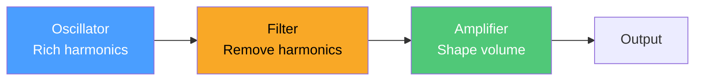
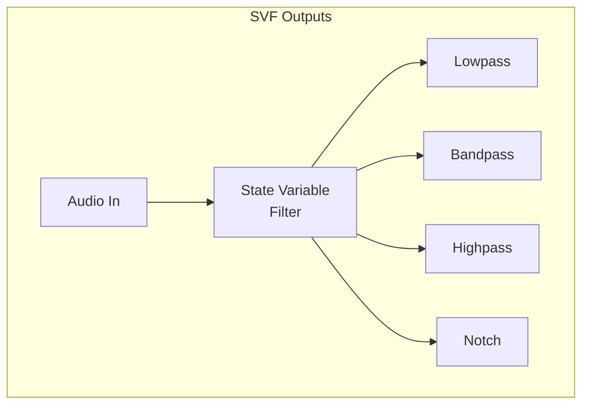
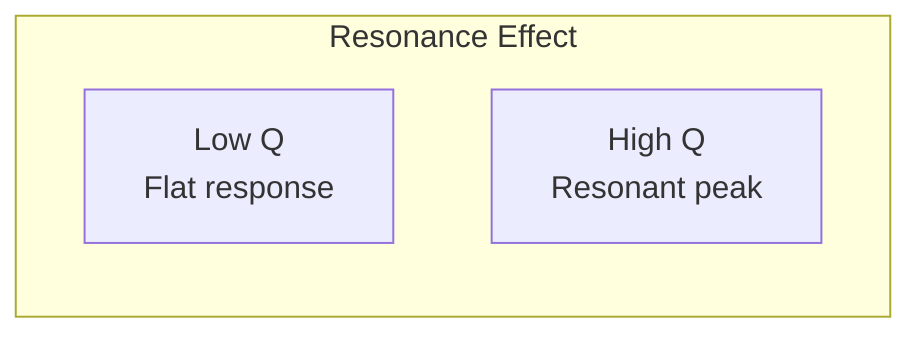

# Basic Subtractive Synthesis

Subtractive synthesis is the foundation of analog synthesizers. Start with a harmonically rich waveform, then sculpt it by filtering away frequencies.



## The Physics of Waveforms

Different waveforms have different harmonic content:

| Waveform | Harmonics | Sound Character |
|----------|-----------|-----------------|
| **Sine** | Fundamental only | Pure, flute-like |
| **Triangle** | Odd harmonics (weak) | Soft, clarinet-like |
| **Sawtooth** | All harmonics | Bright, brassy |
| **Square** | Odd harmonics (strong) | Hollow, woody |

The mathematical representation:

**Sawtooth wave:**
$$x(t) = \frac{2}{\pi} \sum_{k=1}^{\infty} \frac{(-1)^{k+1}}{k} \sin(2\pi k f t)$$

This infinite sum of harmonics is what gives the sawtooth its brightness.

## Building the Patch

```rust,ignore
{{#include ../../../examples/tutorial_subtractive.rs}}
```

## Understanding the Filter

The state-variable filter (SVF) in Quiver simultaneously outputs:
- **Lowpass** — removes high frequencies
- **Bandpass** — isolates a frequency band
- **Highpass** — removes low frequencies
- **Notch** — removes a specific band



### Filter Response

The lowpass filter attenuates frequencies above the cutoff:

$$H(f) = \frac{1}{\sqrt{1 + (f/f_c)^{2n}}}$$

Where $f_c$ is cutoff frequency and $n$ is filter order.

Quiver's SVF is 12dB/octave (2-pole), meaning frequencies one octave above cutoff are reduced by 12dB.

### Resonance

Resonance (Q) boosts frequencies near cutoff:



At maximum resonance, the filter self-oscillates, becoming a sine wave generator.

## Experimenting

1. **Try different waveforms**: Change `"saw"` to `"sqr"` or `"tri"`
2. **Adjust cutoff**: Lower values = darker, muffled sound
3. **Add resonance**: Creates a vowel-like quality
4. **Mix waveforms**: Combine `saw` and `sqr` for thickness

## Classic Tones

| Synth Sound | Waveform | Filter | Character |
|-------------|----------|--------|-----------|
| Moog Bass | Saw | LP, low cutoff | Fat, warm |
| Oberheim Pad | Saw + Saw (detuned) | LP, med cutoff | Lush, wide |
| TB-303 Acid | Saw | LP, high resonance | Squelchy |
| CS-80 Brass | Saw | LP, following envelope | Brassy attack |

---

Next: [Envelope Shaping](./envelope-shaping.md)
